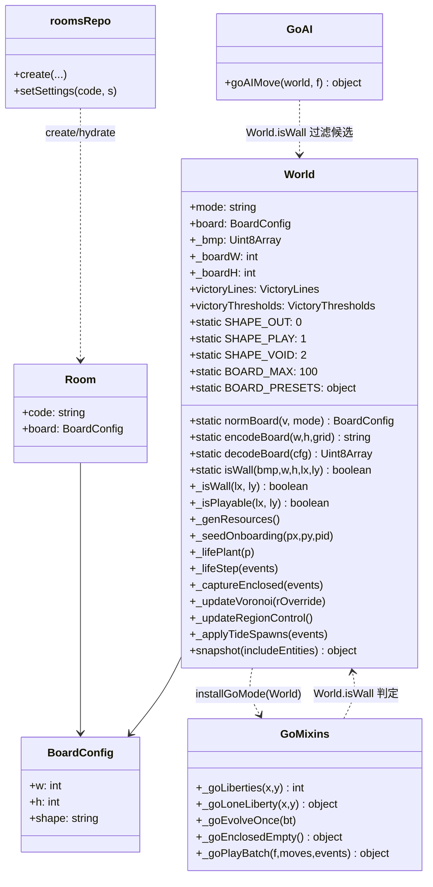
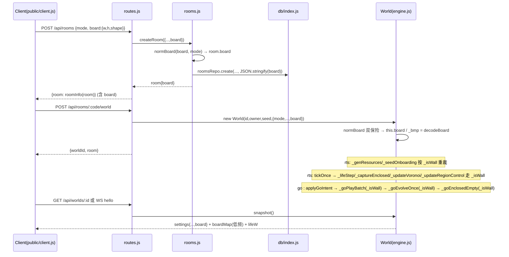
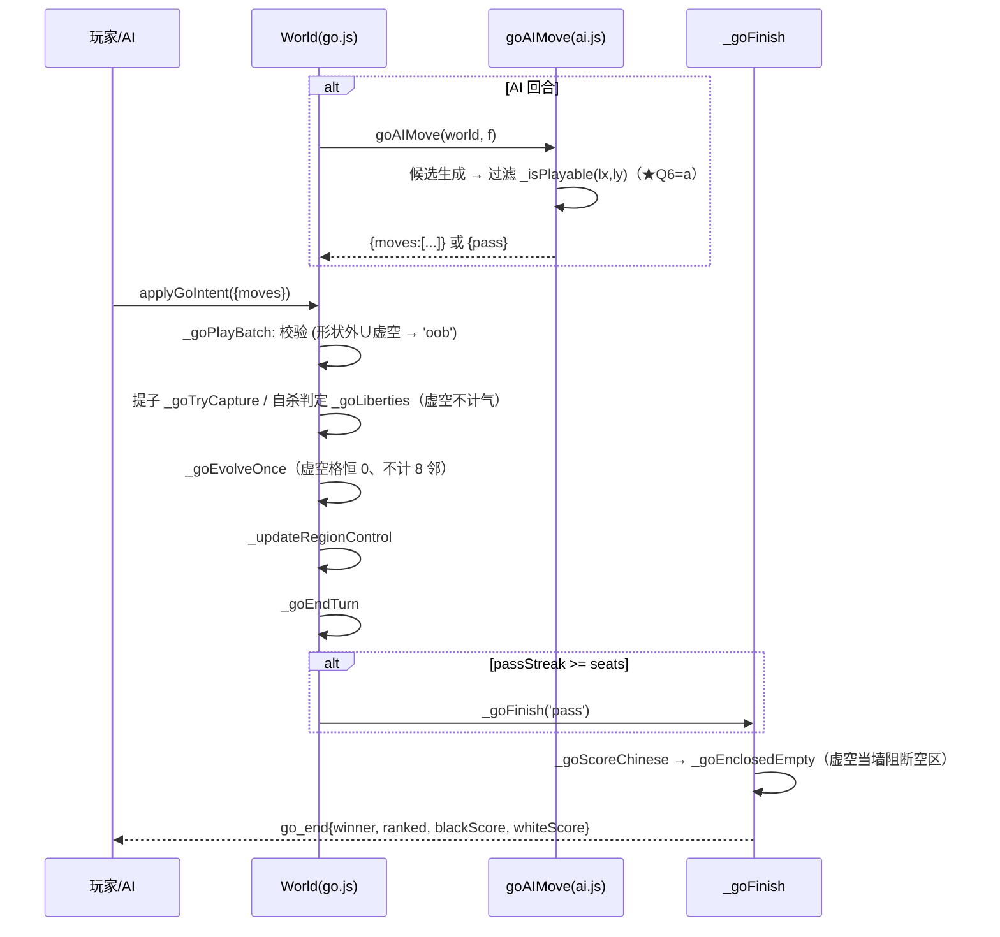
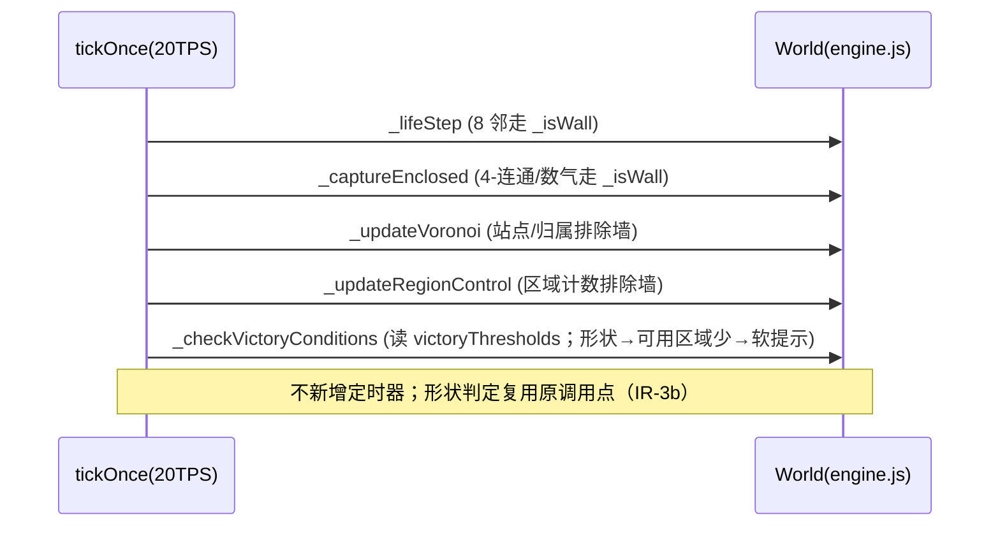
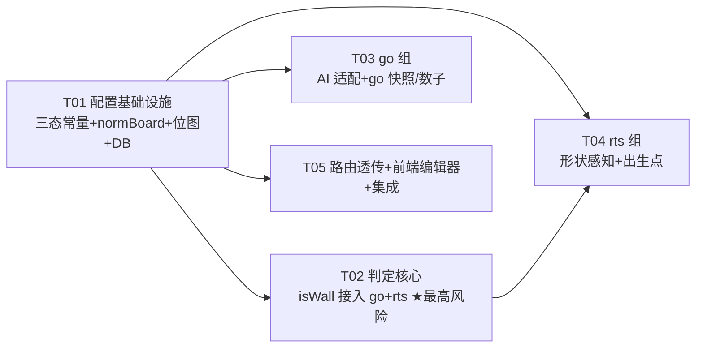

# 可编辑棋盘（形状 + 虚空格）· 增量架构设计与任务分解

> 上游输入：`docs/prd-board-editor.md`（产品经理 · 增量 PRD；含事实表 F1~F13、需求池 BE-01~BE-22、§5 go 影响 G1~G9、§6 rts 影响 R-A~R-I、§8 边界 E1~E14）
> 本文档由 **架构师高见远（Gao）** 依据对 `server/`、`public/`、`tests/`、`server/db/` 的**实际代码核对 + 探针实测**编写。
> 目标目录：`D:\workspace\Game`　|　技术栈：**沿用现状** Node.js + express + `ws` + 原生前端（`server/` + `public/client.js`），**不引入任何新依赖**。
> **可复现的探针**：`scripts/probe/probe_rts_basic.mjs`、`probe_rts_shape.mjs`、`probe_rts_shape2.mjs`、`probe_rts_shape3.mjs`、`probe_rts_decisive.mjs`、`probe_go_shape.mjs`（本次新增，均为只读探针，不改业务源码）。测试基线实测 **320/320 全绿**。

---

## 0. 核对结论（PRD 点名的接入点 + 关键实测数据，逐条）

| PRD 说法 / 锚点 | 实测结果（含行号与探针数据） | 处置 |
|---|---|---|
| F7 配置范式（victoryLines 全链路） | ✅ 逐字段可照抄：`norm*()` `rooms.js` L63–107 → `createRoom` L129–166 → DB 列 `schema.sql` L60–62 → `hydrate` L169–190 → 路由 5 条透传 `routes.js` L111–121 / L241–249 / L259–275 / L397–403 / L319–357 → `World` 构造器 `engine.js` L64–68 → `snapshot().settings` L1507–1514 → `roomInfo` L245–267 → `PATCH /rooms/:code/settings` L464–483 | **逐字段照抄**，新增 `board` 字段，不改链路形状 |
| F8 房主中途改配置接口 | ✅ `routes.js` L464–483，`hostId !== req.user.id → 403 not_host` | 直接挂在此接口；**Q3=a 的强制在服务端此路由加判**（§3.7 裁决 D3） |
| F9 `_clampInt(v, dflt, lo, hi)` | ✅ `engine.js` L768–771（非 number/NaN → dflt；`Math.floor` 取整） | 复用 |
| F10 go「棋盘外」4-邻处理 | ✅ `_goLiberties` L131–152（越界 `continue` 不计气）；`_goEnclosedEmpty` L682–712（越界 `continue`）；`_goScoreChinese` L721–750（子数逐格数 `v>0`） | 形状化落点，**但不止 2 处**（见下条） |
| F11 go 落子校验矩形边界 | ✅ `_goPlayBatch` L266–334（`lx<0||ly<0||lx>=W||ly>=W → 'oob'`，L276） | 扩展为「形状外 ∪ 虚空 → `oob`」 |
| F13 快照尺寸已是变量 | ✅ `snapshot().lifeW` L1537、`go.boardW` L1007；前端 `client.js` L898/L1309/L1369/L1835/L1908/L2864 **全部读 `lifeW`，未写死 32** | 前端零改动即可按新尺寸渲染 |
| §5「go 改动集中在 2 处」 | ⚠️ **实测为 9 处**（`go.js` L143/L172/L225/L293/L351/L407/L539/L606/L698，见探针 `probe_go_shape.mjs`），但**全部是同一行模式** `if (nx<0||ny<0||nx>=W||ny>=W) continue;`；其中 4 处语义关键（气 L143 / 劫 L351 / 演化 L407 / 围空 L698），另 5 处为连通/图案辅助 | 用一个共享纯函数 `World._isWall(lx,ly)`（或 `_isPlayable`）统一替换；**改动面 = 每处 1 行** |
| §6 R-A~R-I rts 风险区 | ⚠️ 实测结论见 **§2**：**算法层是「低风险局部推广」，真正的风险是粒度对齐 + 生成物重裁 + 区域胜利线可达性** | 分期裁定见 §2.6 |
| F1/F2 默认尺寸 | ✅ `LIFE_W=32`（engine L695）、`GO_BOARD_W=32`（go.js L31）、`WORLD_W/H=192`（util L22–23）、`LIFE_CELL=6`（L772）、`REGION_SIZE=24`（L803）；`192/6=32`、`192/24=8` **整除** | 默认 `board=null` → 回现状矩形，行为零变化 |
| 测试基线 | ✅ 探针 `run_tests.mjs` 实测 `# tests 320 / # pass 320 / # fail 0` | 新用例只增不减 |

**一句话结论**：本需求 = **配置面扩展（照抄 F7/F8）+ 一个「墙判定」纯函数的全量推广（go 9 处 / rts 5~6 处，每处 1 行）+ 生成物/出生点的形状感知 + 前端编辑器**。真正的工程风险**不在算法**（探针已证明「越界判定 → 墙判定」是局部等价替换），而在 **rts 的粒度对齐与三态语义的可见性**（§2）。

---

## 1. 实现方案与技术选型

### 1.1 核心技术挑战

| # | 挑战 | 方案 |
|---|---|---|
| C1 | **三态墙语义的单一落点**：形状外(0)/可落子(1)/虚空(2) 在「不可落子 / 不计气 / 不计分 / 阻断连通」上等价，仅 UI 区分 | 定义**唯一纯函数** `isWall(shape, w, h, lx, ly)`（越界 ∪ 0 ∪ 2 → true），所有边界判定统一走它。**0 与 2 在处理上完全同码**，差异只存在于渲染/编辑器 |
| C2 | **默认零变化（不回归）**：不传 `board` 时必须逐字节等价现状 | `board=null` → `World._isWall` 退化为「纯越界判定」（`lx<0||ly<0||lx>=W||ly>=H`），与现状 9+6 处原判定**逐字节等价**。所有新增分支都在 `if (board) {…}` 内 |
| C3 | **rts 的 192×192 世界 / 32×32 生命层 / 8×8 区域 三层尺度** | **保留 192 世界与三层整数关系不动**，形状作为**叠加位图**（生命层粒度 32×32 或世界层粒度，见 §3.1 裁决 D1）；不去改 `WORLD_W/H`、`LIFE_W`、`REGION_SIZE` |
| C4 | **rts 生成物（地形/资源/出生/潮汐）的形状感知** | 形状外不生成资源（`_genResources` 后按位图重裁）；出生点候选必须落可落子格（`pickSpawn` 加过滤）；潮汐边缘生成不落在形状外（`_applyTideSpawns` 边缘换边重试） |
| C5 | **go AI 必须适配非矩形**（Q6=a） | 实测探针：空盘 AI 的天元开局 `(16,16)(17,16)(16,17)` 中 **2/3 可能落在虚空墙上** → 不改则整批非法 → 被判 pass，体验崩坏。改法：`goAIMove` 候选生成 + 空盘 `OFFS` 全部过 `isPlayable` 过滤（`ai.js` L516–600，2 处过滤 + 1 处 `!any` 分支） |
| C6 | **确定性（IR-3a）** | `normBoard` / `isWall` / 预设模板（静态常量）全为纯函数；「随机岛屿」模板走**种子 rng `mulberry32(seed)`**，同 seed 复现同形状。**禁 `Math.random` / `Date.now`**（`go.js`/`ai.js` 有 grep 守卫 GM-17） |
| C7 | **快照体积**（R-H） | 实测：现状 rts 快照 ≈ 33–37KB，其中 **`resPoints` 占 ~26KB（71%）**，`lifeGrid`/`lifeOwner` 各仅 ~2.1KB。**真凶不是生命层**。方案：① 保留 32×32 生命层（形状位图不改生命层尺寸）→ 快照**零增长**；② 形状位图低频下发（`tick<=1` 或变更时，参照 `terrainStr` 的 L1575 范式）→ 每帧只加常数开销 |
| C8 | **旧库/旧房间兼容 + 房主权限 + 已开局禁改** | DB 加 `board TEXT` 幂等 ALTER（三处 DB 回退共用同一 repo）；`hydrate` NULL → `null`；`PATCH` 服务端强制 `w.started` 时拒改（§3.7 D3） |

### 1.2 框架 / 库选择

**无新增依赖**。全部用现有栈：

- 后端：`express` + `ws` + `node:crypto` + 既有 `db/index.js` 适配层（better-sqlite3 / node:sqlite / sql.js 三选一，共用同一 repo）。
- 前端：`public/client.js`（原生 DOM/Vanilla JS）+ `public/index.html`，复用现有 `#modal` 与侧栏面板样式。
- 测试：`node:test` + `node:assert/strict`（现有风格）。
- 编辑器：**纯原生 Canvas / DOM 网格**（不引 SVG 库、不引 React）。10×10~100×100 网格用 `<canvas>` 绘制 + 鼠标事件命中测试（参考 `client.js` 既有 `lifeGrid` 绘制范式）。

### 1.3 架构模式

沿用现状的「**内存权威 + DB 尽力镜像**」+「**配置声明式透传**」模式：

- 房间对象 `room`（内存 `roomHub`）是配置的**运行时权威**；DB 只作重启水合来源。
- `World` 是**配置快照的消费者**：构造时从 `opts` 读一次 `board`、归一、编译成**运行时快速查表的位图**（`this.board` + `this._bmp` + `this._isWall` 快路径），此后判定只读 `this.*`。
- **单一事实源**：三态常量 `SHAPE_OUT=0 / PLAYABLE=1 / VOID=2` 与预设模板只在 `engine.js` 的 `World` 静态字段定义一次；`rooms.js` 的 `normBoard` 通过 `WorldEngine.*` 取值（缺失回退同值字面量）。
- **可选快速路径**：`board=null` 时 `this._bmp = null`，`_isWall` 直接走「矩形越界」微分支，**零额外开销、零行为变化**。

---

## 2. ★ rts 影响面实测结论（本轮最关键，全部有代码证据 + 探针数据）

### 2.1 实测环境

- 探针：`scripts/probe/probe_rts_basic.mjs`、`probe_rts_shape.mjs`、`probe_rts_shape2.mjs`、`probe_rts_shape3.mjs`、`probe_rts_decisive.mjs`。
- 实测数据（`probe_rts_basic.mjs`）：`LIFE_W=32 / LIFE_CELL=6 / REGION_W=8 / REGION_SIZE=24 / WORLD_W=192`；`192/6=32`✅、`192/24=8`✅（**全部整除**）；300 tick 无崩溃；`_lifeXY(192,192)→(31,31)`（**越界被 clamp 进 [0,31]**，非严格拒绝）。

### 2.2 逐条裁决 R-A ~ R-I（有代码证据）

| # | 担心点 | 实测证据 | 判定 | 改动方式 |
|---|---|---|---|---|
| **R-A** | 192×192 世界网格 / 地形生成 | `terrain/resources` 维度恒 `192×192`（probe2：`terrain 192x192`）；`_genTerrain` L93–107、`_genResources` L108–120 **无条件全图填充**。裁掉右上 40×40 后，被裁区内仍有 **139 个已生成资源点**（probe2） | **中风险（生成物须重裁）** | `_genResources` 末尾按形状把形状外资源置 0；地形 `terrain[x][y]` 形状外可保留（或置 `TERRAIN.VOID`），仅客户端不渲染 |
| **R-B** | 32×32 生命层映射 / 对齐 | `_lifeXY(x,y)=floor(x/6)` 且 **clamp**（L867–873）。实测：世界 x=96 → 生命列 16；x=95→15、x=101→16（probe1）。**1 生命格 = 6×6 世界格** → **1 格宽的虚空在世界层画不出墙** | **★中高风险（粒度对齐是本特性 rts 的核心难点）** | 形状编辑与三态语义**统一在生命层（32×32）粒度**：1 个生命格要么全可落子要么全虚空，世界层按 6×6 块填充。见 §3.1 裁决 D1 |
| **R-C** | 8×8 区域控制 / 领土胜利线可达性 | 实测（probe1×probe3）：形状 = **居中 48×48** 时，**仅 4/64 个区域含可落子格**，而 `TERRITORY_WIN=16`（>`eras` 门槛 regions=6）→ **不可达**。形状 = 左半 96×192 → 32/64 可达 | **中风险（可用性，非崩溃）** | **Q4=a 已拍板**：**不自动调门槛**，仅软提示（前端读形状→估算可用区域数→提示房主下调 `victoryThresholds.territoryRegions`）。服务端**不动** |
| **R-D** | Voronoi 势力归属 | 实测（probe2）：在右上角（形状外区域）放强细胞后，`_lifeOwner` 有 **5 个「形状外」生命格被标记为某方势力** → **Voronoi 会蔓延到棋盘外** | **中风险（须排除）** | `_updateVoronoi`（L1256–1291）产出 `_lifeOwner` 后，对 `isWall(lx,ly)` 的格置 0；或站点收集时过滤（L1262–1265） |
| **R-E** | 护城河 `_captureEnclosed` / 城墙 | 实测（probe2/probe4）：`_captureEnclosed` L1085–1135 用 4-连通收团、**dir8 数气**，且**把「己方细胞」也算作气**（L1117 `else if (nv===v) libs++`）；所有边界判定是 `nx<0||ny<0||nx>=W||ny>=W`（L1104/L1114） | **低风险（1 行×2 处）** | L1104（4-连通扩展）+ L1114（数气）两处 `continue` 换成 `if (_isWall(nx,ny)) continue;`。虚空/形状外天然成为「无气区」，成为真墙 |
| **R-F** | AI 寻路 A* | `ai.js` `aiPathTo` L144–170，`blocked` 回调 L156–163 **单一钩子**，现已含越界判定 + 强细胞判定；`ai.js` L158 `if (wx<0||wy<0||wx>=WORLD_W||wy>=WORLD_H) return true;` | **低风险（1 行）** | `blocked` 内加 `|| _isWall(lx,ly)`（用 `world._lifeXY` 已算出的 lx,ly）。**唯一寻路入口**，1 行搞定 |
| **R-G** | 出生点 | `pickSpawn`（`util.js` L45–58）在 W×H 里随机候选取最远；`addPlayer` L153 调它、`makeAIPlayer` L122 调它。**两处唯一调用点**。probe1：P1 spawn(124,124)、P2 spawn(14,43) | **低风险（加过滤）** | `pickSpawn` 增加可选 `isValid(x,y)` 回调：候选点非法（形状外/虚空）→ 重试/跳过。随机模式沿用「离已有玩家最远」；**自选模式**由玩家传坐标，非法 → 拒绝或回退随机（R7/BE-12） |
| **R-H** | 快照体积 | 实测（probe3）：现状 rts 快照 **36806 bytes**，其中 `resPoints=25883(70%)`、`entities=4505`、`lifeGrid=2113`、`lifeOwner=2113`、`regionFaction=129`。100×100 生命层估算 `lifeGrid≈20201`（×9.6） | **低风险（有解法）** | ① 保留 32×32 生命层 → `lifeGrid/lifeOwner` 不变；② 形状位图低频下发（§3.6）；③ 不做 100×100 生命层。**R-H 基本消除** |
| **R-I** | 资源生成 / onboarding | `_seedOnboarding` L248–265 在玩家出生点附近 `±(2..5)` 撒 5 类资源，**未判形状**；`resources[x][y]` 有 `[0,WORLD_W-1]` clamp | **低风险** | `_seedOnboarding` 落点前过 `isPlayable`；`_genResources` 末尾统一重裁形状外 |

### 2.3 决定性探针：把「越界判定」推广为「墙判定」是否局部？

探针 `probe_rts_decisive.mjs` 实测：在 32×32 生命层造一条竖虚空墙 `x=16`，放一条横线棋团 `x=8..24,y=10`：

```
现状（越界=边界）：棋团大小 = 17   ← 虚空被当通路，棋团横跨
形状感知（虚空=墙）：棋团大小 = 8   ← 虚空正确阻断
虚空的另一侧棋子另成团 = 8
```

**改动点盘点（rts 侧，探针输出）**——全部是**同一行模式** `if (nx<0||ny<0||nx>=W||ny>=W) continue;`：

| 位置 | 函数 | 语义 |
|---|---|---|
| `engine.js` L889 | `_lifeTrail` | 留痕（弱痕不跨墙） |
| `engine.js` L935 | `_lifeStep` | 康威演化 8 邻（★核心） |
| `engine.js` L1015 | `_cellCombat` | 棋子近战吞噬 |
| `engine.js` L1104 | `_captureEnclosed`（4-连通收团） | ★护城河 |
| `engine.js` L1114 | `_captureEnclosed`（dir8 数气） | ★护城河 |
| `engine.js` L904 | `_lifePlant` | 落子目标格须为可落子（**新增判定**，非替换） |
| `engine.js` L1262/L1283–1289 | `_updateVoronoi` | 站点/归属须排除墙（**新增**） |
| `engine.js` L1304–1313 | `_updateRegionControl` | 区域计数须排除墙（**新增**） |
| `ai.js` L156–163 | `aiPathTo.blocked` | ★寻路 |
| `engine.js` L648–689 | `_applyTideSpawns` | 潮汐边缘生成不落形状外（**新增**） |
| `engine.js` L248–265 | `_seedOnboarding` | 出生资源不落形状外（**新增**） |
| `util.js` L45–58 | `pickSpawn` | 出生点须落可落子格（**加过滤**） |

**结论**：**「世界内挖虚空」在算法层面是「低风险局部推广」**——5 处纯替换（每处 1 行，语义模式完全一致）+ 若干「生成物/归属/区域」的排除点。**没有发现「假设了 `x*W+y` 连续索引」「假设了矩形遍历无法推广」的硬阻塞**（生命层数组本身就是 `_life[x][y]` 二维，越界判定是唯一耦合点）。

> **⚠️ 一个必须补的点（rts 与 go 都有）**：`_lifeStep`（L924 起）与 `_goEvolveOnce`（L400 起）是**逐格遍历整个生命层矩阵** `for x in [0,W) for y in [0,W)`，其**邻居**判定走 `_isWall`（替换即可），但**格子自身**若是「虚空/形状外」，必须**额外保证 `next[x][y]=0` 且下一个矩阵位置上永不诞生**。否则形状外的格会被邻近细胞「诞生」出来（`n===3` 时），出现「棋盘外长棋子」的 bug。
> → 落地：在 `_lifeStep` / `_goEvolveOnce` 的**每格循环开头**加一行 `if (this._bmp && this._isWall(x, y)) { next[x][y] = 0; continue; }`（`board=null` 时该分支不进入，逐字节不变）。
> → go 侧 `_goEvolveOnce` 同理（PRD G7「虚空格恒为 0、永不诞生」）。**这是本次唯一需要"新增一段"而非纯替换的算法点**，T02 必须覆盖。

### 2.4 真正的难点（不是「硬阻塞」，而是「设计约束」）

1. **粒度稀释（R-B）**：`LIFE_CELL=6` 意味着**世界层的 1 格虚空在生命层不可见**。若允许世界格粒度挖虚空，会出现「显示挖了、但康威/围地完全无感」的困惑。**必须在生命层粒度（6×6 世界格为一块）编辑**，否则三态语义与棋盘演化脱节。
2. **区域胜利线可达性（R-C）**：小形状下 `TERRITORY_WIN=16` 不可达。**Q4=a**：只软提示，服务端不联动。
3. **Voronoi/区域归属排除墙（R-D）**：`_lifeOwner` 会蔓延到棋盘外，须在归属计算后清零墙格。
4. **潮汐/资源/onboarding 的形状感知（R-A/R-I）**：避免「资源撒在棋盘外、潮汐从形状外涌入、出生点落虚空」。

### 2.5 分期结论（Q7 最终裁定）

以「**保留 192 世界 / 32 生命层 / 8 区域三层整数关系不动，形状作为叠加位图**」为前提（见 §3.1 D1）：

| 方案 | 可行性（实测） | 工作量 | 风险 | 裁定 |
|---|---|---|---|---|
| **(a) rts 完整三态（世界内挖虚空当墙）** | **可行**：决定性探针证明算法层是 1 行×N 的局部替换；无硬阻塞 | 中（替换 5 处 + 生成物/归属/区域 6 处 + 出生点 + 编辑器） | 中：风险集中在**粒度对齐语义**（须以生命格编辑）、快照下发、区域可达提示 | **推荐**：**分期落地** —— **P0 先做「裁外部形状」（BE-11 最小集），P1 再做「世界内挖虚空」** |
| **(b) rts 仅裁外部形状（不挖内部虚空）** | **低风险**，改动更小 | 小（仅 `isWall` 的 0 分支 + 生成物重裁 + 出生点 + 区域提示） | 低 | **建议作为 rts 的 P0 首期**（见下方分期） |
| **(c) rts 不做** | — | — | 与 R6「两模式都生效」冲突 | **不采纳**（用户已拍板 R6） |

**★ rts 分期建议（最终）**：

- **Phase-rts-1（P0，本次必做）**：**形状外裁剪**（`shape=0` 格）：世界层不可通行、生命层对应格恒空且**不作为气**、资源/onboarding/潮汐/出生点均不落形状外、Voronoi/区域排除形状外。→ 满足 BE-11 的「至少」验收项。
- **Phase-rts-2（P1，本次可做，风险可控）**：**世界内挖虚空**（`shape=2` 格）：在 Phase-1 的 `isWall` 判定里把 `2` 也纳入即可（**本质是同一函数多认一个态**），配合编辑器「挖虚空」工具。实测证明这**不增加算法风险**，只是**多一个编辑器入口 + 多一次的 UI 三态渲染**。
- **落地节奏**：两阶段共用**同一个** `isWall` / 同一份位图 / 同一套编辑器；Phase-rts-1 与 Phase-rts-2 的**代码差异仅为「编辑器是否开放挖虚空 + `isWall` 是否把 2 当墙（同一函数，一行开关）**」。→ **建议一次实现、分期暴露**：后端一次到位（三态都支持），前端先只放「裁外部形状」的模板，虚空工具作为 P1 放开。

> **一句话**：**rts 做完整三态可行、且成本可控**（算法层已探针证明为 1 行×N 的局部推广）；**建议不等不砍**，按「后端三态一次到位 / 前端裁形状先上、挖虚空 P1 放开」分期交付。

### 2.6 go 侧影响面（实证，风险低，但比 PRD 说的多）

探针 `probe_go_shape.mjs` 实测：

| 实测项 | 现象 | 结论 |
|---|---|---|
| `_goLiberties` 贴虚空单子 | 现状气 = **4**（把虚空当空格算了 1 气） | 须改为 **3**（虚空不计气）→ G1 属实 |
| `_goEnclosedEmpty` 围空 | 现状 `fa` 围住 **974** 个空点（空区穿过"虚空"连到全盘） | 虚空须从洪水填充 `continue`（当墙）→ G4/G5 属实 |
| `goAIMove` 空盘开局 | 天元开局候选 `(16,16)(17,16)(16,17)`，**2/3 落在 x=16 虚空墙**（形状化后） | **Q6=a 证实**：必须过滤，否则整批非法→pass |
| `_goEvolveOnce` 虚空格 | 强行放子后被演化抹为 0 | 须显式「虚空格恒 0、不计邻居」→ G7 |

**go 侧修改点清单（`go.js` 9 处 + `ai.js` 3 处）**：

- `go.js`：L143 `_goLiberties`(★气)、L172 `_goTryCapture`、L225 `_goGroupSig`、L293 `_goPlayBatch` 提子邻接、L351 `_goLoneLiberty`(★劫)、L407 `_goEvolveOnce`(★演化)、L539 `_goPatternBonus`、L606 `_goCanShift`、L698 `_goEnclosedEmpty`(★围空)。
- `go.js`：`_goPlayBatch` L276 越界校验扩展为「形状外 ∪ 虚空 → `oob`」（Q2=a 复用 `oob`）。
- `ai.js`：`goAIMove` L524–532 候选生成过滤、L533–551 空盘 `OFFS` 过滤、L556–589 打分前过滤 `isPlayable`。

> **go 侧 PRD 判断修正**：PRD §5 说「集中在 `_goLiberties` 与 `_goEnclosedEmpty` 两处」→ **实测为 9 处**（但同一 1 行模式）；`_goScoreChinese` 子数逻辑**确实天然兼容**（虚空/形状外本就无子）——PRD 该判断成立。

---

## 3. 数据结构与接口

### 3.1 `board` 对象结构（唯一契约）

**配置层（透传/存储的形态）**：

```js
/**
 * @typedef {Object} BoardConfig
 * @property {number} w             画布宽（1..100，整数，已钳制；生命层/世界层语义见 D1）
 * @property {number} h             画布高（1..100）
 * @property {string} shape         紧凑位图串：行优先，'.'=形状外 / '#'=可落子 / 'x'=虚空，
 *                                  行间 '/' 分隔。长度 = w*h + (h-1)
 */
// 例：3×3 中间挖空 → { w:3, h:3, shape:"###/#x#/###" }
// 不配置 → board = null（回现状矩形）
```

**运行时层（World 编译后的形态）**：

```js
// World 构造器内（board 非空时编译）：
this.board = { w, h, shape };                    // 归一后的配置（供快照回显）
this._boardW = board ? board.w : null;
this._boardH = board ? board.h : null;
this._bmp = board ? World.decodeBoard(board) : null; // Uint8Array(w*h)，值 ∈ {0,1,2}
```

**三态常量（唯一事实源，`engine.js` `World` 静态字段）**：

```js
static SHAPE_OUT = 0;   // 形状外（棋盘之外）
static SHAPE_PLAY = 1;  // 可落子（形状内）
static SHAPE_VOID = 2;  // 虚空格（形状内的「墙」）
static SHAPE_CHARS = { '.': 0, '#': 1, 'x': 2 };
static SHAPE_CHARS_INV = ['.', '#', 'x'];
static BOARD_MAX = 100;   // 画布尺寸上限
static BOARD_MIN = 1;
```

**唯一墙判定纯函数（静态）**：

```js
/**
 * (lx,ly) 是否「不可落子/墙」—— 越界 ∪ 形状外 ∪ 虚空 → true。
 * board 为 null（不配置）时**逐字节等价于现状矩形越界判定**。
 * @param {Uint8Array|null} bmp  Life-cell 粒度位图（null = 未配置）
 * @param {number} w @param {number} h
 * @param {number} lx @param {number} ly  生命格坐标（rts/go 统一用生命层坐标）
 * @returns {boolean}
 */
static isWall(bmp, w, h, lx, ly) {
  if (lx < 0 || ly < 0 || lx >= w || ly >= h) return true;
  return bmp[ly * w + lx] !== World.SHAPE_PLAY;   // 0 或 2 → 墙
}
// 实例便捷法（避免每处传参）：
_isWall(lx, ly) { return this._bmp ? World.isWall(this._bmp, this._boardW, this._boardH, lx, ly)
                                   : (lx < 0 || ly < 0 || lx >= World.LIFE_W || ly >= World.LIFE_W); }
_isPlayable(lx, ly) { return !this._isWall(lx, ly); }
```

> **索引方式（裁决 D2）**：位图**行优先 `bmp[y*w + x]`**（与 `_life[x][y]` 的列优先后翻转）。
> **为降低混淆，统一采用 `bmp[ly*w + lx]`（y 行 x 列）**，并在编解码一处收口；`_life` 仍为 `_life[x][y]`（现状，不动）。

### 3.2 序列化格式与编解码

```js
/** 编码：{w,h,shape} → 紧凑串（行优先，'/' 分行，'.'/'#'/'x'）。 */
static encodeBoard(w, h, grid) {   // grid[ly][lx] ∈ {0,1,2}
  const rows = [];
  for (let ly = 0; ly < h; ly++) {
    let s = '';
    for (let lx = 0; lx < w; lx++) s += World.SHAPE_CHARS_INV[grid[ly][lx]] || '.';
    rows.push(s);
  }
  return rows.join('/');
}
/** 解码：紧凑串 → Uint8Array(w*h)（行优先）。非法字符 → 形状外(0)。 */
static decodeBoard(cfg) {
  const { w, h, shape } = cfg;
  const out = new Uint8Array(w * h);
  const rows = String(shape).split('/');
  for (let ly = 0; ly < h; ly++) {
    const row = rows[ly] || '';
    for (let lx = 0; lx < w; lx++) out[ly * w + lx] = World.SHAPE_CHARS[row[lx]] ?? 0;
  }
  return out;
}
```

### 3.3 `normBoard(v, mode)` 签名与伪码（纯函数，双保险：engine 静态 + rooms 转发）

```js
/**
 * 棋盘形状归一（唯一实现放 engine.js 静态方法；rooms.js 只转发，避免环依赖）。
 * 非法 / null / '' / 解析失败 → null（回现状矩形）。
 * @param {object|string|null|undefined} v  {w,h,shape} 或 JSON 串
 * @param {('rts'|'go'|null|undefined)} mode
 * @returns {{w:number,h:number,shape:string}|null}
 */
static normBoard(v, mode) {
  let o = v;
  if (typeof o === 'string') { try { o = JSON.parse(o); } catch { return null; } }
  if (!o || typeof o !== 'object') return null;              // E1/E12：无 shape → 默认矩形
  const w = World._clampInt(o.w, 0, World.BOARD_MIN, World.BOARD_MAX);
  const h = World._clampInt(o.h, 0, World.BOARD_MIN, World.BOARD_MAX);
  if (!w || !h) return null;                                 // w/h 非法 → 回默认
  const shape = String(o.shape == null ? '' : o.shape);
  const rows = shape.split('/');
  if (rows.length !== h) return null;                        // 行数不符 → 回默认
  for (const r of rows) if (r.length !== w) return null;     // 列数不符 → 回默认
  // 字符合法性：非法字符视为形状外（不整体回默认，宽容）；但若全为形状外 → 回默认
  let hasPlay = false;
  for (const r of rows) for (const c of r) if (c === '#') hasPlay = true;
  if (!hasPlay) return null;                                 // E3：全形状外/全虚空 → 回默认矩形
  return { w, h, shape };
}
```

> **模式差异**：`normBoard` 对 `mode` **不做差异化**（go/rts 都能用形状）。差异体现在 UI（go 无出生点）与运行时（rts 三态、go 三态；二者对「墙」的语义一致）。

### 3.4 预设模板（静态常量，`engine.js` 的 `World.BOARD_PRESETS`）

6 个模板（Q5=a）：`rect`（经典矩形）/ `cross`（十字）/ `castle`（城堡）/ `twins`（双岛）/ `ring`（回字）/ `islands`（随机岛屿）。

```js
static BOARD_PRESETS = {
  rect:    { label:'经典矩形', gen: (w,h) => World._fillRect(w,h) },        // 全 1
  cross:   { label:'十字',     gen: (w,h) => World._genCross(w,h) },
  castle:  { label:'城堡',     gen: (w,h) => World._genCastle(w,h) },
  twins:   { label:'双岛',     gen: (w,h) => World._genTwins(w,h) },
  ring:    { label:'回字',     gen: (w,h) => World._genRing(w,h) },
  islands: { label:'随机岛屿', gen: (w,h,seed) => World._genIslands(w,h,seed) }, // ★走种子 rng
};
```

- **确定性（IR-3a）**：`rect/cross/castle/twins/ring` 是**静态几何**（纯函数，无随机）；`islands` 用 `mulberry32(seed)` 生成（**禁 `Math.random`**），同 `seed` 复现同形状。
- **微调**：`[微调尺寸]` = 改 `w/h` 后按同 `gen` 重生成；`[旋转 90°]` = 对当前位图做转置（纯函数）。

### 3.5 类图（正式版见 `docs/class-diagram.mermaid`）



### 3.6 快照与形状下发（R-H 解法）

- **`snapshot().settings.board`** = `this.board`（归一后的 `{w,h,shape}`）。
- **`snapshot().boardMap`**（新增，**低频**）：编译后的位图串（`shape`）——仅在 `tick<=1 或 board 变更时`下发，其余帧 `null`（参照 `terrainStr` 的 L1575 范式）。
- **生命层尺寸**：rts 恒 `lifeW=32`（形状不改生命层矩阵尺寸，只在其上叠加位图）→ `lifeGrid/lifeOwner` 快照**零增长**。
- **go**：`boardW` 反映 `LIFE_W`（=形状化的生命层宽，若 go 生命层随形状变宽——见裁决 D1）。

> **若将来 go 生命层随画布变大**：`lifeGrid` 会按 `LIFE_W` 膨胀。**本次裁决 D1 建议统一「生命层 = 画布 w×h」**，即 go 的 `LIFE_W = board.w`（≤100），rts 的生命层仍 32×32（世界层 192，形状位图生命层粒度）。→ 见 §3.1 裁决 D1 的取舍。

### 3.7 设计裁决（请明确写进文档，team-lead 特别要求）

| # | 事项 | 裁定 | 依据 |
|---|---|---|---|
| **D0** | `winReason` 是否仍用 `'go'` | **是，仍用 `'go'`**。上一特性（arch-victory-config §8 A4）已实测全仓库**无榜单/统计依赖 `winReason`**；`scoresRepo` 只存 `score`。本特性**不改变**该结论，`winReason` 仍是 `'go'` | 零影响、改动最小 |
| **D1** | 形状编辑与三态语义的**粒度** | **生命层粒度（rts 32×32；go 画布 w×h）**。rts：1 生命格 = 6×6 世界格，形状位图落生命层，世界层按 6×6 块填充；go：画布即生命层 1:1。**不在世界格粒度编辑**（否则虚空被 6× 稀释、语义脱节，见 §2.4-1） | 探针 probe1/§2.4 |
| **D2** | 位图索引方式 | **行优先 `bmp[ly*w + lx]`**（`_life` 保持现状 `[x][y]`）；编解码在 `encodeBoard/decodeBoard` 一处收口 | 防混淆 |
| **D3** | 已开局禁改形状（Q3=a）**服务端强制** | **在 `PATCH /rooms/:code/settings` 内强制**：`if (b.board !== undefined && w && w.started) return { code:403, message:'board_locked', data:{reason:'started'} }`。**不依赖前端置灰**（前端置灰只是 UX；服务端是真门禁）。同时 `normBoard` 对已开局传入返回 `null` 不写库 | Q3=a；PRD E7 |
| **D4** | 虚空落子错误码（Q2=a） | **复用 `oob`**（形状外与虚空在「不可落子」上等价）。前端已处理 `oob`，**零改动** | Q2=a |
| **D5** | 快照下发 | `snapshot().settings.board`（每帧，小对象）+ `snapshot().boardMap`（低频，位图串）。**不下发 100×100 数组** | §3.6；probe3 |
| **D6** | 是否新增依赖 | **否**（原生 Canvas/DOM 编辑器） | §1.2 |
| **D7** | 预设模板数 | **6 个**（Q5=a）：rect/cross/castle/twins/ring/islands | Q5=a |

---

## 4. 程序调用流程

### 4.1 形状配置透传链（建房 → 判决 → 快照）



### 4.2 房主中途改形状（含已开局门禁）

```mermaid
sequenceDiagram
  participant H as Host(房主)
  participant R as routes.js
  participant RM as rooms.js
  participant DB as db/index.js
  participant W as World

  H->>R: PATCH /api/rooms/:code/settings {board}
  R->>RM: getRoom(code)
  R->>R: hostId !== req.user.id ? 403 not_host
  R->>R: w.started && board 传入 ? 403 board_locked  (★Q3=a 服务端强制)
  R->>RM: normBoard(board, mode)
  RM->>DB: roomsRepo.setSettings(code, {board})
  RM->>W: w.board = normalized; w._bmp = decodeBoard(...)  (内存权威覆盖)
  R-->>H: {code:0, board, room: roomInfo(room)}
  Note over H: 其他玩家下一次 snapshot → settings.board / boardMap 生效
```

### 4.3 go 形状化落子与终局（含 AI）



### 4.4 rts 形状化 tick（形状判定复用原调用点，IR-3b）



---

## 5. 任务列表（有序 · 含依赖 · go 与 rts 分开成组）

> **共 5 个任务**（硬性上限 5）。**go 组 = T03；rts 组 = T04**（便于按 §2.5 分期结论调整——rts 分期只影响 T04 内部拆分，不新增任务）。
> T01 = 项目/配置基础设施（常量 + 归一 + DB + 位图编译，全放一个任务）；T02 = 后端判定核心（`isWall` 全量接入 go+rts 的算法层）；T05 = 前端编辑器 + 路由透传 + 集成。

### T01 · 配置基础设施：三态常量 + `normBoard` + 位图编解码 + DB 持久化（P0）

- **涉及文件**：
  - `server/engine.js`：新增 `SHAPE_OUT/PLAY/VOID`、`BOARD_MAX/MIN`、`BOARD_PRESETS`、静态 `normBoard/encodeBoard/decodeBoard/isWall` + 实例 `_isWall/_isPlayable/_compileBoard`；构造器 L68 后新增 `this.board = World.normBoard(opts.board, this.mode)` + `this._bmp = ...`（`board=null` → 全走现状）；6 个预设 `_gen*`（`islands` 走 `mulberry32`）
  - `server/rooms.js`：转发导出 `normBoard`；`createRoom` L137 附近写 `room.board`；`hydrate` L181 附近读 `row.board`（缺列/NULL → `null`）；`setRoomSettings` L323 加 `board` 分支
  - `server/db/schema.sql`：rooms 表加 `board TEXT`（L62 后）
  - `server/db/index.js`：`migrate()` L128 后加幂等 `ALTER TABLE rooms ADD COLUMN board TEXT`；`roomsRepo.create` L328 INSERT + `setSettings` L350 UPDATE 加 `board` 列（三处 DB 回退共用此 repo）
- **依赖**：无（首个任务）
- **风险**：低。**单一事实源**必须落此任务（三态常量、`_clampInt` 复用、位图索引 `bmp[ly*w+lx]`）
- **验收**：`createRoom({})` → `board=null`；`normBoard({w:0,...})` → `null`；DB 往返一致；旧库缺列不报错；`encodeBoard/decodeBoard` 互逆

### T02 · 判定核心：`isWall` 全量接入 go + rts 算法层（P0 · ★最高风险）

- **涉及文件**：
  - `server/engine.js`：`_lifeStep` L935、`_cellCombat` L1015、`_captureEnclosed` L1104/L1114、`_lifeTrail` L889 的越界 `continue` → `if (this._isWall(nx,ny)) continue;`；`_lifePlant` L904 加「目标格非可落子 → return null」；`_updateVoronoi` L1262/L1283 排除墙；`_updateRegionControl` L1304 排除墙；`_genResources`/`_seedOnboarding`/`_applyTideSpawns` 形状重裁
  - `server/go.js`：9 处 L143/L172/L225/L293/L351/L407/L539/L606/L698 越界 → `_isWall`；`_goPlayBatch` L276 校验扩展（形状外∪虚空 → `oob`）
  - `server/ai.js`：`goAIMove` L524–532/L533–551/L556–589 候选与空盘 `OFFS` 过滤；`aiPathTo.blocked` L156–163 加 `_isWall`
  - `server/util.js`：`pickSpawn` L45 加可选 `isValid(x,y)` 过滤（rts 出生点）
  - `tests/board_editor.test.mjs`：**新增**（go 气/连通/围空/自杀/演化、虚空阻断连通、rts 退化等价）
- **依赖**：T01（读 `_isWall`/`_bmp`/`_clampInt`）
- **风险**：**高**。① 9+5 处替换必须**保持 `board=null` 时逐字节不变**（用探针 §2.3 的等价性验证）；② `_goEvolveOnce` 虚空格恒 0；③ `_updateVoronoi`/区域排除墙的顺序（须在归属算完后清零）；④ 不引入随机（GM-17 grep 守卫覆盖 `go.js`/`ai.js`）
- **验收**：`npm test` 320/320 仍全绿（不传 board）；新单测证明「虚空阻断连通、不计气、当墙围地、不可落子」；rts 出生点必落可落子格

### T03 · go 组：AI 适配 + go 快照/数子 + go 模式回归（P0）

- **涉及文件**：
  - `server/ai.js`：`goAIMove` 非矩形候选过滤（★Q6=a；空盘天元开局须全落可落子格）
  - `server/go.js`：`_goSnapshotState` L1007 `boardW` 反映形状化生命层宽；（如需）`_goEnclosedEmpty`/`_goScoreChinese` 输出含 `board` 明细
  - `server/engine.js`：`snapshot().settings.board`（L1513 附近）+ `boardMap` 低频下发（L1575 范式）
  - `tests/board_editor.test.mjs`：go AI 在非矩形盘的选点合法性、`_goScoreChinese` 在虚空隔断下的归属
- **依赖**：T01
- **风险**：中。AI 过滤遗漏会导致「非法落子被当 pass」（Q6=a 的失败态）；`boardW` 变化不得破坏前端渲染（前端已读 `lifeW`）
- **验收**：非矩形 go 局 AI 不频繁 pass；形状外/虚空不是 AI 候选；go 快照 `boardMap` 只在建/改时出现

### T04 · rts 组：形状感知（Phase-1 裁外部 / Phase-2 挖虚空）+ 出生点自选/随机（P0）

- **涉及文件**：
  - `server/engine.js`：`_genResources`/`_seedOnboarding`/`_applyTideSpawns` 形状重裁（Phase-1）；`_isWall` 已天然含 `SHAPE_VOID`（Phase-2 无需改算法，仅编辑器放开）
  - `server/util.js` + `engine.js`：rts 出生点「随机（过滤可落子格）/ 自选（校验 + 非法回退随机）」；`addPlayer`/`makeAIPlayer` 走新 `pickSpawn`
  - `server/routes.js`：出生点自选透传（`POST /rooms/:code/world` 的 `opts.spawnMode/spawnXY`，或建房时设定）
  - `tests/board_editor.test.mjs`：rts 出生点必落可落子格、形状外无资源、区域可用数统计
- **依赖**：T01、T02（依赖 `_isWall`；rts 算法层接入在 T02）
- **风险**：中（**Phase-1 低 / Phase-2 中**）。粒度对齐（D1）必须在编辑器体现；区域胜利线可达性给软提示不联动
- **验收**：形状外不可通行/无资源/不生成潮汐；出生点落可落子格；居中 48×48 形状给出「领土线可能不可达」软提示

### T05 · 路由透传 + 前端编辑器（双入口）+ 集成（P0）

- **涉及文件**：
  - `server/routes.js`：5 条透传路径（`ensureWorld` L111 / `worldForRoom` L135 / `POST /worlds` L241 / `POST /rooms`（两分支）L325/L345 / `POST /rooms/:code/world` L397 / **`GET /worlds/:id` 反查重建 L259–275**）全部加 `board`；`PATCH /settings` L464 加 `board` 分支 + **已开局门禁 `board_locked`**（D3）
  - `server/rooms.js`：`roomInfo` L245–267 输出 `board`
  - `public/index.html`：建房弹窗「高级设置 · 棋盘形状」折叠区 + 房内「棋盘形状」面板行 + 只读缩略图容器（§4 UI 草图）
  - `public/client.js`：`roomOpts()` 收集 `board`；新增 `BoardEditor` 组件（canvas 网格：笔刷/矩形/填充/擦除/形状↔虚空/尺寸/旋转/重置/保存/取消）；预设模板选择；实时预览；只读缩略图；房主 `PATCH`；已开局置灰+提示；rts 出生点区（go 不渲染）；HUD「棋盘：WxH · 模板名」
  - `tests/board_editor.test.mjs`：透传/回读、PATCH 房主校验、已开局 403、重启重建不丢（含 `GET /worlds/:id` 路径）
- **依赖**：T01（字段契约）；与 T02/T03/T04 无强依赖（只消费快照/roomInfo）
- **风险**：中。**透传有 5 条路径**（含 `GET /worlds/:id` 反查重建），任一处漏传即静默丢配置；编辑器纯前端（canvas），无算法风险
- **验收**：非房主 403 `not_host`；已开局改形状 403 `board_locked`；房主改后下次快照可见；重启后不丢；旧库/旧房间不报错；go 界面不出现出生点项

### 任务依赖图



> **说明**：T03/T04/T05 均只依赖 T01（满足「禁止过多线性依赖链」）；T04 额外依赖 T02（rts 算法层接入在 T02 落地）。**rts 分期（Phase-1/Phase-2）只影响 T04 内部的交付批次，不新增任务**（≤5 硬上限）。

---

## 6. 依赖包

**预计无新增**。本次不引入任何第三方包。

```
- 后端：express / ws / node:crypto（均现有）
- DB：better-sqlite3 | node:sqlite | sql.js（现有适配层三选一，无改动）
- 前端：原生 DOM + <canvas>（无框架、无 SVG 库）
- 测试：node:test / node:assert/strict（Node 内置）
```

---

## 7. 共享知识 / 跨文件约定

1. **三态常量的唯一定义处**：`server/engine.js` 的 `World` 静态字段 —— `World.SHAPE_OUT=0`（形状外）/ `World.SHAPE_PLAY=1`（可落子）/ `World.SHAPE_VOID=2`（虚空）。**任何地方不得再写字面 0/1/2**；`rooms.js` 通过 `WorldEngine.*` 取值（缺失回退同值字面量）。
2. **位图索引方式**：`bmp[ly*w + lx]`（**行优先，y 行 x 列**）。`_life` 保持现状 `_life[x][y]`。编解码只在 `World.encodeBoard/decodeBoard` 一处收口。
3. **墙判定契约**：**0 与 2 在「不可落子 / 不计气 / 阻断连通 / 不参与计分」上完全等价**，唯一区别是 UI 渲染与数据保留。所有边界判定统一走 `this._isWall(lx,ly)`（go/rts 用**生命层坐标**）。
4. **错误码约定**：虚空与形状外落子**统一返回 `oob`**（D4，复用现状）。**不新增 `reason`**。
5. **已开局门禁**：`PATCH /rooms/:code/settings` 传 `board` 且 `w.started` → `403 board_locked`（D3，服务端强制）。
6. **字段命名**：后端 JS 用 `board`（camelCase）；DB 列用 `board`（TEXT，存 JSON 串）；序列化串 `'.'/'#'/'x'`，行间 `'/'`。
7. **默认值来源单一事实源**：`board=null` 的语义（回现状矩形）只在 `World.normBoard` 定义一次。
8. **不回归契约**：`_isWall` 在 `board=null` 时**必须逐字节等价**于现状 `nx<0||ny<0||nx>=W||ny>=W`；所有形状分支都在 `if (this._bmp)` 内。
9. **确定性铁律**：`normBoard`/`isWall`/预设（静态）/旋转全为**纯函数**；「随机岛屿」走 `mulberry32(seed)`；**禁 `Math.random` / `Date.now`**（`go.js`/`ai.js` 有 GM-17 grep 守卫）。
10. **透传契约**：任何把 `board` 从房间/请求送到 `World` 的地方（**5 条路径，含 `GET /worlds/:id` 反查重建**）必须并列带上 `board`。
11. **DB 存储契约**：`board` 列存 JSON 串；读时 `normBoard` 兜底；缺列/NULL → `null`（回默认）。三级 DB 回退（better-sqlite3 → node:sqlite → sql.js）**共用同一 repo**，加列必须三处都覆盖。
12. **快照契约**：`snapshot().settings.board`（每帧，`{w,h,shape}|null`）+ `snapshot().boardMap`（**低频**，编译位图串，`tick<=1||变更` 时非 null）。**不下发 100×100 数组**。

---

## 8. 后续 QA 测试建议（呼应 PRD §8 E1~E14）

| 组 | 用例 | 对应边界 |
|---|---|---|
| 归一/钳制 | `normBoard`：`w=0/101/-1/1.5/'x'` → 夹到 `1/100/1/1/null`；`shape=null/''/垃圾串/长度不符/全形状外` → `null` | E2/E12/E3 |
| 默认零变化 | 不传 `board` → go 32×32 / rts 192×192 的落子/气/提子/数子/区域结果与改动前**逐字节一致**；320/320 全绿 | E1/M1 |
| 尺寸边界 | `1×1` 与 `100×100` 可建房/开局/落子/结束，无越界崩溃 | E11/BE-04 |
| go 虚空语义 | ① 贴虚空棋团的 4 邻**不含虚空**（气 = 现状−1）；② 虚空**阻断同色连通**（提子分别判气）；③ 虚空格不可落子（`oob`）；④ 靠虚空落子无气且未提子 → `suicide` 回滚 | E5/E6/G1~G3 |
| go 数子 | 虚空隔开两空区 → **分别**归属；虚空本身**不计子数、不产生归属**；空盘/整盘虚空 → 双方同分平局 | E3/G4~G6 |
| go 演化 | 靠虚空棋子的 8 邻不含虚空；虚空格**恒 0**、永不诞生 | G7 |
| go AI | 非矩形盘 AI 只在可落子格选点，**不频繁 pass**；空盘天元开局全落合法格 | Q6=a |
| rts 形状外 | 形状外不可通行/无资源/不生成潮汐/不出生；Voronoi 与区域归属**不含形状外** | R-A/R-D/R-I |
| rts 虚空（Phase-2） | 虚空当墙：`_captureEnclosed` 中虚空无气、成墙；`_lifeStep` 不穿越虚空；A* 不绕进虚空 | R-E/R-F |
| rts 出生点 | 随机/自选均落可落子格；非法坐标拒绝或回退随机；**无连通块智能分配** | E4/BE-12/R-G |
| rts 区域可达 | 居中 48×48 形状 → 可用区域 < `TERRITORY_WIN` → **软提示**（不自动调门槛） | E14/Q4 |
| 房主权限 | 非房主 403 `not_host`；**已开局改形状 403 `board_locked`**（服务端，非仅前端） | E10/E7/Q3 |
| 旧库兼容 | 旧 schema DB 启动不报错、读默认；旧内存房间首次访问补默认；可正常开局 | E8/E9 |
| 确定性 | 形状相关代码**无 `Math.random`/`Date.now`**；「随机岛屿」同 seed 复现同形状 | E13/IR-3a |
| 透传完整性 | **5 条路径**（含 `GET /worlds/:id` 反查重建）重启后 `board` 不丢 | M2 |

---

## 9. 待明确事项（若有）

| # | 事项 | 架构师建议 | 需确认？ |
|---|---|---|---|
| **U1** | **rts 生命层 vs 世界层的编辑粒度**（D1）：以生命格（6×6 世界格）为单位编辑，还是允许世界格？ | **建议生命格**（否则虚空被 6× 稀释、语义脱节）。若产品坚持世界格精度，需接受「视觉上挖了但演化无感」 | ⚠️ 建议产品确认 |
| **U2** | **go 生命层尺寸是否随画布变**：`LIFE_W = board.w`（画布 ≤100）是否会让 `lifeGrid` 快照膨胀？ | **建议 go 生命层 = 画布 w×h**（go 无世界层，1:1 最自然）；配合 `boardMap` 低频下发。**100×100 go 局 `lifeGrid` 约 20KB/帧**，若不可接受可限制 go 画布上限（如 ≤64） | ⚠️ 建议产品确认上限 |
| **U3** | **rts 的 `board.w/h` 与 192 世界的关系**：形状位图是「在 192 世界内裁形状」还是「世界尺寸 = 画布 w×h」？ | **建议位图叠加在 192 世界**（保留三层整数关系，零破坏，见 §2.5）。`board.w/h` 仅描述位图有效区，世界恒 192×192 | ⚠️ 建议产品确认（影响"画布 100×100"在 rts 下的视觉尺度） |
| **U4** | **rts Phase-2（世界内挖虚空）是否本迭代交付** | **建议后端一次到位（三态都支持），前端「挖虚空」工具作为 P1 放开**（见 §2.5）。若排期紧，Phase-1 单独交付也满足 R6/BE-11 最小集 | ⚠️ 建议按排期决定 |
| **U5** | **区域胜利线软提示的阈值口径** | 建议前端按「含可落子格的区域数」估算，< `victoryThresholds.territoryRegions` 时提示，**不自动改阈值**（Q4=a） | 否（实现细节） |

---

## 10. 与项目铁律的一致性自检

| 铁律 | 落实 |
|---|---|
| **算法是世界法则，单位是涌现** | 不新增单位/名词；`board` 只是**静态地形配置**，「虚空」是**地形属性**而非实体；不生成任何单位 |
| **延迟 = 惯性（不检测不补偿）** | 形状配置随快照/`roomInfo` 广播，无延迟补偿；玩家只「读到最新配置」 |
| **IR-3a 算法确定性** | `normBoard`/`isWall`/`encodeBoard`/`decodeBoard`/预设/旋转全为**纯函数**；「随机岛屿」走 `mulberry32(seed)`；**不引入任何 `Math.random`/`Date.now`**；`GM-17` grep 守卫（`go.js`/`ai.js`）仍通过 |
| **IR-3b 离散 tick** | rts 形状判定**复用原调用点**（`_lifeStep`/`_captureEnclosed`/`_updateVoronoi`/`_updateRegionControl` 均已在 20TPS tick 内），**不新增定时器**；go 在落子/演化/终局结算点判定 |
| **不回归（精确表述）** | 不传 `board` → `_isWall` **逐字节等价**现状越界判定；go/rts 的落子/气/提子/数子/区域判定结果**与改动前一致**；`npm test` **320/320 全绿**（实测基线），新增用例只增不减 |
| **数据安全** | `board TEXT` 列幂等 ALTER（三处 DB 回退共用 repo）；旧库缺列 → 补列；旧行 NULL → `null`（回默认）；`DB_PATH` 默认 `':memory:'` **不改** |

---

> **交付物清单**：`docs/arch-board-editor.md`（本文）、`docs/class-diagram.mermaid`（更新）、`docs/sequence-diagram.mermaid`（更新）、`scripts/probe/*.mjs`（实测探针，只读）。
> **未提交任何业务代码**（探针为只读脚本）。
