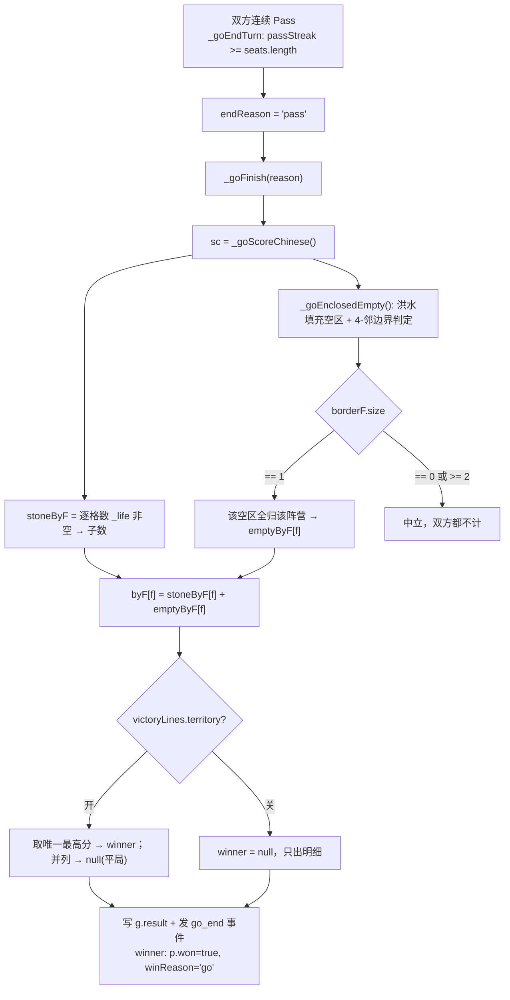
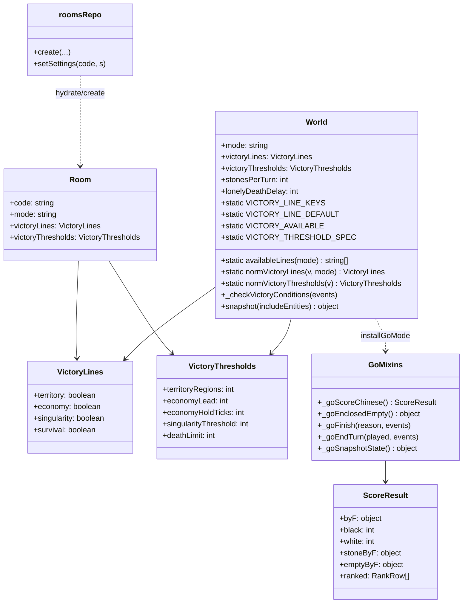
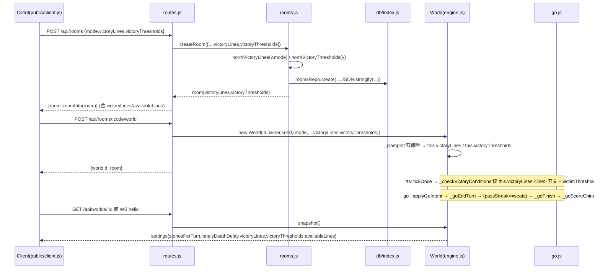
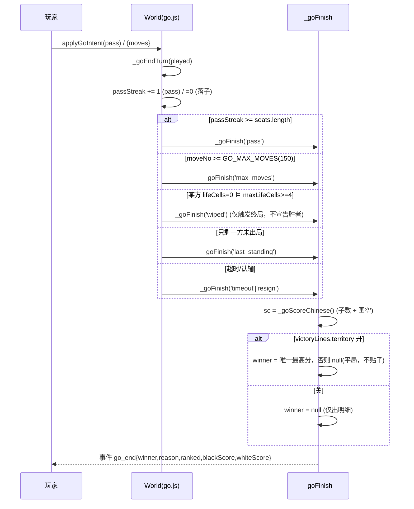
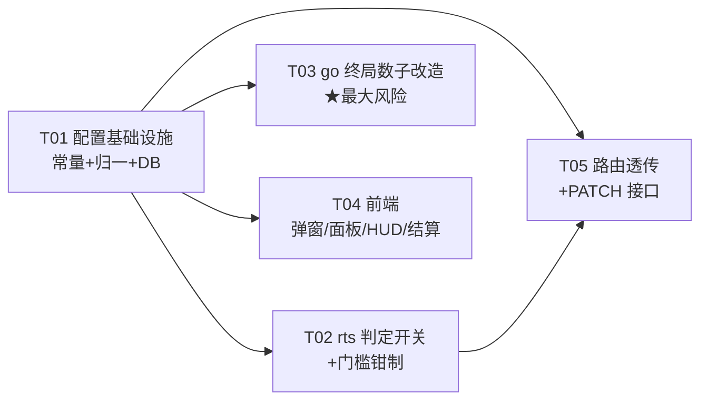

# 房主可配置胜利条件 · 增量架构设计与任务分解

> 上游输入：`docs/prd-victory-config.md`（产品经理 · 增量 PRD，已两轮修订，含实读代码事实表 F1~F10 + F5a~F5f）
> 本文档由 **架构师高见远（Gao）** 依据对 `server/`、`public/`、`tests/`、`server/db/` 的实际代码核对编写。
> 目标目录：`D:\workspace\Game`　|　技术栈：**沿用现状** Node.js + express + `ws` + 原生前端（`server/` + `public/client.js`），**不引入任何新框架**。

---

## 0. 核对结论（PRD 点名的接入点，逐条实测）

| PRD 说法 | 实测结果 | 处置 |
|---|---|---|
| F1 判定集中在一个函数，4 线全开、写死常量 | ✅ `server/engine.js` `_checkVictoryConditions()` L1357–1403；唯一调用点 L591（`tickOnce` 内） | 每条线外套 `if (this.victoryLines.<line>)`，门槛改读 `this.victoryThresholds.*` |
| F7 配置范式（stonesPerTurn/lonelyDeathDelay 全链路） | ✅ `norm*(…)` `rooms.js` L34–48 → `createRoom` L70–101 → DB 列 `schema.sql` L48–59 → `hydrate` L104–123 → 路由透传 `routes.js` L110–135/L231–241/L313–341/L381–385 → `World` 构造器 `engine.js` L57–63 → `snapshot().settings` L1428 → `roomInfo` L162–204 | **逐字段照抄**，新增两列两字段，不改链路形状 |
| F8 `_clampInt(v, dflt, lo, hi)` 通用钳制已存在 | ✅ `engine.js` L703–706 | 复用；新增门槛安全区间常量 |
| F5a 「双方连续停手」机制已存在 | ✅ `go.js` L685–688 `if (g.passStreak >= seats.length) endReason='pass'`；`passStreak` 初始化 L65/L69，座位变化归零 L119 | **复用、不新写**。终局触发路径一行不改 |
| F5c 「吃光即判胜」 | ✅ `go.js` L691–699（`wiped` 置 `p.lost` 且 `endReason='wiped'`）/ L706–708（`last_standing`） | **用户明确要求推翻**：`wiped`/`last_standing` **不再作为宣告胜者的依据**，但**保留其"触发终局"能力**（见 §3.6 裁决 Q1a） |
| F5d `_goScore` 用 Voronoi 归属格数 | ✅ `go.js` `_goScore` L634–671：`_updateVoronoi(breathR)` → 数 `_lifeOwner` 归属格 + 图案奖 | **本次最大风险点**：改造为「中国规则数子（子数 + 围住的空点）」，新增独立函数 `_goScoreChinese()`，`_goFinish` 改调它（见 §3.6 算法） |
| F5e 现状无贴子（komi） | ✅ `_goScore` L634–671 双方同口径、无黑/白偏移 | 用户拍板「双方完全公平，不做 komi」→ **不实现贴子** |
| Q3 `winReason` 用 `'go'` 还是 `'territory'` | ❌ 实测 `go.js` L756 `p.winReason='go'`；全仓库**无任何榜单/统计依赖 `winReason`**（`scoresRepo` 只存 `score`，`tests/` 无断言 `winReason==='go'`） | ✅ **沿用 `'go'`**：改动最小、不影响既有口径；前端文案区分用 `reason` 字段 |
| 交付日期/铁律 | ✅ IR-3a：`go.js`/`ai.js` 由 `GM-17`（`tests/go_mode.test.mjs` L303–316）grep 守卫，禁 `Math.random`/`Date.now` | 本功能**不引入任何随机**；归一/钳制/数子均为纯函数 |
| 现有测试基线 | ✅ `tests/` 共 22 个 `.mjs`；go 相关 `go_mode.test.mjs` 有 **GM-11 / GM-13 / GM-25** 断言终局语义 | 语义变更相关断言需同步（明确清单见 §7 与 §9） |

**结论**：本需求 = **配置面扩展（照抄 F7）+ rts 判定加开关 + go 终局胜负依据改为数子法**。前两块风险低、可完全复用现状范式；**唯一高风险点是 go 数子算法改造**，本文 §3.6 给出完整算法设计与伪码。

---

## 1. 实现方案与技术选型

### 1.1 核心技术挑战

| # | 挑战 | 方案 |
|---|---|---|
| C1 | **配置单向透传、单一事实源**：一个配置项要经过 createRoom→DB→hydrate→路由→World→snapshot→roomInfo→前端 8 个环节，任一处漏传都会「静默丢配置」 | 逐字段照抄 `stonesPerTurn` 全链路；`norm*` 归一 → DB 存 JSON 串 → `hydrate` 读取兜底 → 路由 `opts` 透传 → `World` 构造器 `_clampInt` 双保险 |
| C2 | **旧库/旧内存房间兼容**：缺列、NULL、升级前已在内存的房间 | `migrate()` 加幂等 `ALTER TABLE ADD COLUMN`；`norm*` 对 `undefined/null/''/非 JSON` 一律回默认；`roomInfo`/`World` 对缺失字段即时补默认 |
| C3 | **rts 行为逐字节不变** | `victoryThresholds` 默认值 = 原硬编码常量（`TERRITORY_WIN=16` 等）；不传配置时 `_checkVictoryConditions` 走与原代码**完全相同的分支与数值** |
| C4 | **go 数子算法（子数 + 空点）** | 从 Voronoi 归属格数改为**中国规则数子**：盘面己方棋子数 + 己方围住的空点（用**4-邻域浮空连通块单侧围空法**）。新增 `_goScoreChinese()`，不动 `_goScore()`（保留给 rts-go 兼容/图案奖快照） |
| C5 | **模式差异化开关集** | `availableLines(mode)`：rts→4 条，go→仅 `[territory]`；`normVictoryLines(v, mode)` 在 go 下**强制归零** economy/singularity/survival（防 API 越权） |
| C6 | **确定性铁律** | 归一、钳制、数子全部是纯函数；不触碰 `mulberry32` 种子流；`go.js`/`ai.js` 仍通过 `GM-17` grep 守卫 |

### 1.2 框架 / 库选择

**无新增依赖**。全部用现有栈：
- 后端：`express` + `ws` + `node:crypto` + 既有 `db/index.js` 适配层（better-sqlite3 / node:sqlite / sql.js 三选一）。
- 前端：`public/client.js`（原生 DOM/Vanilla JS）+ `public/index.html`，复用现有 `#modal` 与侧栏面板样式。
- 测试：`node:test` + `node:assert/strict`（现有风格）。

### 1.3 架构模式

沿用现状的「**内存权威 + DB 尽力镜像**」+「**配置声明式透传**」模式：
- 房间对象 `room`（内存，`roomHub`）是配置的**运行时权威**；DB 只作重启水合来源。
- `World` 是**配置快照的消费者**：构造时从 `opts` 读一次、归一、落到 `this.*`，此后判定只读 `this.*`。
- 判定函数保持**纯查询语义**（读 `this.victoryLines` / `this.victoryThresholds`），不反向写配置。
- **单一事实源**：默认值与安全区间的字面量只在 `engine.js` 的 `World` 静态字段定义一次，`rooms.js` 的 `norm*` 通过 `WorldEngine.XXX || 字面量兜底` 取值（与 `stonesPerTurnDefault()` L25–28 同款）。

---

## 2. 文件列表及相对路径

### 2.1 修改（6 个）

| 文件 | 操作 | 改动摘要 |
|---|---|---|
| `server/engine.js` | 改 | ① 新增胜利线常量族（`VICTORY_LINE_KEYS`/`VICTORY_LINE_DEFAULT`/`VICTORY_AVAILABLE`/各门槛 MIN/MAX）挂 `World`；② `constructor` L57–63 后新增 `this.victoryLines` / `this.victoryThresholds`（经 `_clampInt` 兜底）；③ `_checkVictoryConditions` L1357–1403 每条线加开关 + 门槛改读 `this.victoryThresholds.*`；④ `snapshot()` L1428 `settings` 增 `victoryLines`/`victoryThresholds`/`availableLines`；⑤ 新增静态助手 `World.normVictoryLines`/`World.availableLines`（供 rooms.js 复用，避免循环依赖） |
| `server/go.js` | 改 | ① **新增** `_goScoreChinese()`（中国规则数子，核心）；② **新增** `_goEnclosedEmpty()`（4-邻浮空围空判定，`_goScoreChinese` 依赖）；③ `_goFinish` L730–758 胜负依据改为「`victoryLines.territory` 开 → 数子定胜负；关 → 不宣告胜者」；④ `_goEndTurn` L691–708：`wiped`/`last_standing` **仅降级为「触发终局」**，不再写入胜者；⑤ `_goSnapshotState` L872–921 新增 `chineseScore` 明细字段 |
| `server/rooms.js` | 改 | ① 新增 `normVictoryLines(v, mode)` / `normVictoryThresholds(v)`（照抄 `normStonesPerTurn` 风格，默认值取 `WorldEngine.*`）；② `createRoom` L70–101 归一后写 `room.victoryLines`/`room.victoryThresholds` 并传给 `roomsRepo.create`；③ `hydrate` L104–123 从 DB 读、缺列回默认；④ `roomInfo` L162–204 增 `victoryLines`/`victoryThresholds`/`availableLines`（世界为权威，否则房间记录）；⑤ 新增 `setRoomSettings(code, patch)`（供 PATCH 路由写回内存 + DB） |
| `server/routes.js` | 改 | ① `POST /worlds` L222–241、`POST /rooms` L307–342（两条分支）、`POST /rooms/:code/world` L366–396、`ensureWorld` L104–127 / `worldForRoom` L129–136 全部把 `victoryLines`/`victoryThresholds` 加进 `opts` 透传；② **新增** `PATCH /rooms/:code/settings`（仅房主，参照 pause 路由 L434–443 的 `hostId` 校验范式） |
| `server/db/schema.sql` | 改 | rooms 表新增两列（L48–63 内）：`victory_lines TEXT`、`victory_thresholds TEXT`（JSON 串，NULL 允许） |
| `server/db/index.js` | 改 | ① `migrate()` L118–136 `alters` 数组加两条幂等 `ALTER TABLE rooms ADD COLUMN ...`；② `roomsRepo.create` L324–337 INSERT 语句与参数加两列；③ `roomsRepo` 新增 `setSettings(code, {victoryLines, victoryThresholds})` UPDATE |

### 2.2 修改（前端 2 个）

| 文件 | 操作 | 改动摘要 |
|---|---|---|
| `public/index.html` | 改 | 建房弹窗「模式」下拉下方新增「高级设置 · 胜利条件」折叠区（`<details>`）容器 + 房内「胜利条件」面板行 + 只读展示容器 + go 数子结算面板容器 |
| `public/client.js` | 改 | ① `roomOpts()` L164–176 收集 `victoryLines`（按模式渲染的勾选状态）；② 新增 `renderVictoryLines(mode, value, editable)` 组件（两处入口复用）；③ 模式切换时静默丢弃不支持项 + 灰字提示；④ 房内面板房主可编辑 → `PATCH /api/rooms/:code/settings`；⑤ HUD 常驻「胜利条件：…」行（读 `snapshot.settings.victoryLines`）；⑥ `go_end` 结算面板改读 `chineseScore` 明细（含「吃光不算赢」文案） |

### 2.3 新增测试（1 个）

| 文件 | 操作 | 内容 |
|---|---|---|
| `tests/victory_config.test.mjs` | **新增** | VC-01~VC-15 的单测：归一/钳制、默认仅领土、go 强制归零、DB 往返、房主中途改配置、旧库兼容、go 数子口径、清盘不判胜、双方 Pass 终局 |

### 2.4 文档产出（本文档要求）

| 文件 | 说明 |
|---|---|
| `docs/arch-victory-config.md` | 本文件 |
| `docs/sequence-diagram.mermaid` | 程序调用时序图（§4） |
| `docs/class-diagram.mermaid` | 数据结构与接口类图（§3） |

---

## 3. 数据结构与接口

### 3.1 胜利线常量族（`server/engine.js`，`World` 静态字段）

```js
// ---- 胜利线键集（唯一事实源；三端共用）----
static VICTORY_LINE_KEYS = ['territory', 'economy', 'singularity', 'survival'];
// 默认：仅【领土】（PRD VC-03 / M2）
static VICTORY_LINE_DEFAULT = { territory: true, economy: false, singularity: false, survival: false };
// 按模式可用的开关集（PRD VC-04 / M3）
static VICTORY_AVAILABLE = {
  rts: ['territory', 'economy', 'singularity', 'survival'],
  go:  ['territory'],                       // 「吃光不算赢」→ go 无 survival
};
// 门槛安全区间（PRD VC-11 / E9）：[lo, hi]，默认 = 原硬编码常量（C3 逐字节不变）
static VICTORY_THRESHOLD_SPEC = {
  territoryRegions:   { dflt: 16,  lo: 6,   hi: 40  },   // 原 TERRITORY_WIN = 16
  economyLead:        { dflt: 600, lo: 200, hi: 2000 },  // 原字面量 600
  economyHoldTicks:   { dflt: 1800,lo: 300, hi: 6000 },  // 原字面量 1800
  singularityThreshold:{ dflt: 30, lo: 6,   hi: 200 },   // 原 SINGULARITY_THRESHOLD = 30
  deathLimit:         { dflt: 12,  lo: 3,   hi: 50  },   // 原 DEATH_LIMIT = 12
};
```

> **默认值来源单一事实源**：`rooms.js` 的 `norm*` 通过 `WorldEngine.VICTORY_THRESHOLD_SPEC` / `VICTORY_LINE_DEFAULT` 取默认，缺失时回退**同值字面量**（防 `engine.js` 未加载）。

### 3.2 配置 Schema

**`victoryLines`** —— 4 个布尔开关：

| 字段 | 类型 | 默认 | 说明 |
|---|---|---|---|
| `territory` | boolean | `true` | 领土线（rts：占区+帝国时代；go：终局数子） |
| `economy` | boolean | `false` | 经济线（仅 rts；go 强制 false） |
| `singularity` | boolean | `false` | 采集线（仅 rts；go 强制 false） |
| `survival` | boolean | `false` | 灭族线（仅 rts；go 强制 false，因「吃光不算赢」） |

**`victoryThresholds`** —— rts 门槛数值（整数，已钳制）：

| 字段 | 类型 | 默认 | 安全区间 | 对应原常量 |
|---|---|---|---|---|
| `territoryRegions` | int | 16 | [6, 40] | `World.TERRITORY_WIN` |
| `economyLead` | int | 600 | [200, 2000] | 字面量 600 |
| `economyHoldTicks` | int | 1800 | [300, 6000] | 字面量 1800 |
| `singularityThreshold` | int | 30 | [6, 200] | 字面量 30 |
| `deathLimit` | int | 12 | [3, 50] | `World.DEATH_LIMIT` |

> **go 不消费 `victoryThresholds`**（语义无关），但仍透传/存储以保持 schema 统一、便于将来扩展。前端在 go 下不渲染门槛输入。

### 3.3 归一函数签名（`server/rooms.js`）

```js
/**
 * 胜利线归一：非法输入回默认；go 模式下强制 economy/singularity/survival = false（防越权）。
 * @param {object|string|null|undefined} v 入参（对象或 JSON 串）
 * @param {('rts'|'go'|null)} mode
 * @returns {{territory:boolean, economy:boolean, singularity:boolean, survival:boolean}}
 */
export function normVictoryLines(v, mode) { /* …见 §3.4 伪码… */ }

/**
 * rts 门槛归一：逐字段 _clampInt 到安全区间；非数字/空 → 默认。
 * @param {object|string|null|undefined} v
 * @returns {{territoryRegions:number, economyLead:number, economyHoldTicks:number,
 *            singularityThreshold:number, deathLimit:number}}
 */
export function normVictoryThresholds(v) { /* …见 §3.4 伪码… */ }
```

**引擎侧双保险**（`World` 静态助手，供 rooms.js 复用避免循环依赖）：

```js
static availableLines(mode) {
  return (World.VICTORY_AVAILABLE[mode] || World.VICTORY_AVAILABLE.rts).slice();
}
static normVictoryLines(v, mode) { /* 与 rooms.js 同逻辑；rooms.js 直接复用本函数 */ }
static normVictoryThresholds(v)  { /* 同上 */ }
```

> **依赖方向防环**：`rooms.js` 已经 `import { World as WorldEngine } from './engine.js'`（L16），所以把归一逻辑**放 engine.js 静态方法**、rooms.js 只做「转发 + 导出」，最干净。

### 3.4 归一/钳制伪码

```js
World.normVictoryLines = function (v, mode) {
  let o = v;
  if (typeof o === 'string') { try { o = JSON.parse(o); } catch { o = null; } }
  const out = { ...World.VICTORY_LINE_DEFAULT };
  if (o && typeof o === 'object') {
    for (const k of World.VICTORY_LINE_KEYS) if (typeof o[k] === 'boolean') out[k] = o[k];
  }
  // 模式门禁：go 只允许 territory（VC-05 / E5）
  const allow = World.VICTORY_AVAILABLE[mode] || World.VICTORY_AVAILABLE.rts;
  for (const k of World.VICTORY_LINE_KEYS) if (!allow.includes(k)) out[k] = false;
  return out;
};

World.normVictoryThresholds = function (v) {
  let o = v;
  if (typeof o === 'string') { try { o = JSON.parse(o); } catch { o = null; } }
  const out = {};
  for (const [k, spec] of Object.entries(World.VICTORY_THRESHOLD_SPEC)) {
    const raw = (o && typeof o === 'object') ? o[k] : undefined;
    out[k] = World._clampInt(typeof raw === 'string' ? Number(raw) : raw, spec.dflt, spec.lo, spec.hi);
  }
  return out;
};
```

> `_clampInt` 已对「非 number / NaN / Infinity」回落 `dflt`（engine.js L703–706），并 `Math.floor` 取整 → 覆盖 E9（负数/超大/非数字/小数）。空的字符串数字 `'7'` 走 `Number(raw)` 转数字（与 `normStonesPerTurn` 对 `'7'` 的容忍一致）。

### 3.5 DB 变更

**schema.sql（rooms 表）**——在 L59 后追加：

```sql
  -- 胜利条件（房主设定；JSON 串；旧库由 migrate() 补列；NULL = 回退默认）
  victory_lines TEXT,           -- JSON: {"territory":true,"economy":false,...}
  victory_thresholds TEXT,      -- JSON: {"territoryRegions":16,...}
```

**db/index.js `migrate()`**——`alters` 数组追加两条（幂等，列已存在报错被忽略）：

```js
'ALTER TABLE rooms ADD COLUMN victory_lines TEXT',
'ALTER TABLE rooms ADD COLUMN victory_thresholds TEXT',
```

**`roomsRepo.create`**——INSERT 加两列：

```js
'INSERT INTO rooms(code,world_id,owner_id,max_players,visibility,passhash,name,mode,'
+ 'stones_per_turn,lonely_death_delay,victory_lines,victory_thresholds,created_at) '
+ 'VALUES (?,?,?,?,?,?,?,?,?,?,?,?,?)',
[ /* …原参数… */,
  opts && opts.victoryLines      ? JSON.stringify(opts.victoryLines)      : null,
  opts && opts.victoryThresholds ? JSON.stringify(opts.victoryThresholds) : null,
  Date.now() ]
```

**新增 `roomsRepo.setSettings`**（供 PATCH 中途改配置）：

```js
setSettings: (code, s) => db().run(
  'UPDATE rooms SET victory_lines=?, victory_thresholds=? WHERE code=?',
  [ s.victoryLines ? JSON.stringify(s.victoryLines) : null,
    s.victoryThresholds ? JSON.stringify(s.victoryThresholds) : null, code ]),
```

**`hydrate`**——缺列/NULL 回默认：

```js
victoryLines:      normVictoryLines(row.victory_lines, row.mode || null),   // null → 默认
victoryThresholds: normVictoryThresholds(row.victory_thresholds),
```

### 3.6 ★ go 数子算法设计（中国规则 · 子数 + 空点）— 本需求核心风险点

#### 3.6.1 问题定义

**现状**（`_goScore` L634–671）：`目数 = Voronoi 归属格数（含呼吸半径）+ 图案奖` —— 是「领地/势力占比」，**不是围棋的「子数 + 空点数」**。
**目标**（PRD VC-10）：终局后按**中国规则数子**——「己方棋子数 + 己方围住的空点数」，多者胜。**不贴子**（用户拍板）。

#### 3.6.2 关键决策：如何判「围住的空点」归属？

盘面 `_life[x][y]` 取值语义（go 模式，见 `go.js` L356/L415/L428/L445）：`0` = 空点，`f ∈ {1..8}` = 阵营 f 的棋子。

用**浮空连通块 + 4-邻边界单侧归属法**（标准围棋「数子法」的一种确定性实现）：

1. 扫描所有 `0` 的空点，对**未被访问**的空点做 **4-邻洪水填充（flood fill）**，得到一个**连通空区** `E`。
2. 统计 `E` 的所有格子的 **4-邻接触**到的**非空格子阵营集合** `borderF`（去重；忽略越界——棋盘边**不算**归属方）。
3. 归属规则（确定性，无随机）：
   - `borderF` **恰好 1 个阵营** `f` → 该空区 `E` **全部归 f**（= f 围住的空点）；
   - `borderF` 为空（整盘无子/该区不接触任何子）**或 ≥ 2 个阵营** → 该空区为**中立**（双方都不计）。
4. 最终每方得分：

```
score(f) = (盘面上 _life 值 === f 的格子数，即"子数")
         + (归 f 的空区格数总和，即"围住的空点数")
```

> **为什么用 4-邻**：与 `_goLiberties` / `_goTryCapture` 一致（go.js L131/L158 用 `NEI4`），围棋「气/连通」本就是 4-邻语义。用 8-邻会把「对角接触」误判为围住。
>
> **为什么「≥2 阵营 → 中立」**：这是「双方共有、谁都围不住」的空，符合数子法直觉；也保证**确定性**（不引入任何 tie-break 随机）。
>
> **为什么不吃 Voronoi/图案奖**：用户要的是围棋真规则。Voronoi 归属（`_lifeOwner`）与图案奖语义属「演化棋」旧口径，**不进 `_goScoreChinese`**；`_goScore` 原函数保留（rts 快照 `go.territory` 与旧测试 GM-10/GM-23 仍用它，避免连带回归）。

#### 3.6.3 伪码

```js
// go.js — 新增

/** 4-邻浮空围空：返回按阵营统计的"围住的空点数"。
 *  @returns {{byF:Object<number,number>}}  f -> 空点数（只含被单一阵营围住的空区）
 */
P._goEnclosedEmpty = function () {
  const W = World.LIFE_W, L = this._life;
  const seen = new Uint8Array(W * W);          // 访问标记（0/1）
  const byF = Object.create(null);
  for (let x = 0; x < W; x++) for (let y = 0; y < W; y++) {
    const key = x * W + y;
    if (L[x][y] !== 0 || seen[key]) continue;  // 只从"未访问的空点"起 BFS
    // --- 洪水填充一个连通空区 ---
    const stack = [[x, y]]; seen[key] = 1;
    const cells = [];                          // 本空区全部空格
    const borderF = new Set();                 // 接触到的非空阵营（越界不计）
    while (stack.length) {
      const [cx, cy] = stack.pop(); cells.push([cx, cy]);
      for (const [dx, dy] of NEI4) {
        const nx = cx + dx, ny = cy + dy;
        if (nx < 0 || ny < 0 || nx >= W || ny >= W) continue;   // 棋盘边 = 无归属
        const v = L[nx][ny];
        if (v === 0) { const k = nx * W + ny; if (!seen[k]) { seen[k] = 1; stack.push([nx, ny]); } }
        else borderF.add(v);                   // 记录接触到的阵营
      }
    }
    // --- 归属判定：恰好单一阵营围住 → 全部计给它；否则中立 ---
    if (borderF.size === 1) {
      const f = borderF.values().next().value;
      byF[f] = (byF[f] || 0) + cells.length;
    }
  }
  return { byF };
};

/** 中国规则数子：子数 + 围住的空点数。纯函数、无随机、O(W²)。
 *  @returns {{byF, black, white, ranked, emptyByF, stoneByF}}
 */
P._goScoreChinese = function () {
  const g = this._goInit();
  const W = World.LIFE_W, L = this._life;
  const stoneByF = Object.create(null);
  for (let x = 0; x < W; x++) for (let y = 0; y < W; y++) {
    const v = L[x][y];
    if (v > 0) stoneByF[v] = (stoneByF[v] || 0) + 1;   // 子数（go 盘只有 1..8）
  }
  const { byF: emptyByF } = this._goEnclosedEmpty();   // 空点归属
  const byF = Object.create(null);
  for (const k of new Set([...Object.keys(stoneByF), ...Object.keys(emptyByF)])) {
    byF[k] = (stoneByF[k] || 0) + (emptyByF[k] || 0);
  }
  const black = byF[g.blackF] || 0, white = byF[g.whiteF] || 0;
  const ranked = (g.seats || []).map((pid, i) => {
    const f = g.seatF[i], p = this.players[pid];
    return {
      playerId: pid, faction: f, name: p ? p.name : String(pid),
      isAI: !!(p && p.isAI), botControlled: !!(p && p.botControlled), lost: !!(p && p.lost),
      score: byF[f] || 0,                                  // 数子总分
      stones: stoneByF[f] || 0,                             // 明细：子数
      empty: emptyByF[f] || 0,                              // 明细：围住空点
      territory: byF[f] || 0,                               // 兼容别名字段（前端/旧代码）
    };
  }).sort((a, b) => b.score - a.score);
  return { byF, black, white, stoneByF, emptyByF, ranked };
};
```

#### 3.6.4 `_goFinish` 改造（胜负依据）

```js
P._goFinish = function (reason, events) {
  const g = this._goInit();
  const sc = this._goScoreChinese();            // ← 从 _goScore() 改为中国规则数子
  const alive = sc.ranked.filter(r => !r.lost);
  const pool = alive.length ? alive : sc.ranked;
  let winner = null;
  // 胜利线【领土】开着才宣告胜者；关掉 → winner=null（E6/VC-02）
  if (this.victoryLines && this.victoryLines.territory && pool.length) {
    const top = pool[0];
    const tie = pool.filter(r => r.score === top.score && r.faction !== top.faction);
    winner = tie.length ? null : top.playerId;  // 唯一最高才算胜；并列 → 平局（不贴子）
  }
  g.result = {
    winner, reason,
    ranked: pool.map(r => ({ playerId: r.playerId, name: r.name, faction: r.faction,
                             score: r.score, stones: r.stones, empty: r.empty })),
    blackScore: sc.black, whiteScore: sc.white,          // 两方局主文案
    blackTerritory: sc.black, whiteTerritory: sc.white,  // 兼容旧字段名（值口径已变更）
    moves: Math.max(0, g.moveNo - 1),
  };
  events.push({ type: 'go_end', winner, reason, ranked: g.result.ranked,
    blackScore: sc.black, whiteScore: sc.white, moves: g.result.moves });
  if (winner != null) {
    const p = this.players[winner];
    if (p) { p.won = true; p.winReason = 'go'; }         // Q3 裁决：沿用 'go'（无榜单依赖，已实测）
  }
};
```

#### 3.6.5 `_goEndTurn` 改造（`wiped`/`last_standing` 降级为「只触发终局」）

```js
// L691-699：清盘不再"宣告胜者"，只登记淘汰 + 触发终局（Q1a 裁决）
for (const pid of seats) {
  const p = this.players[pid];
  if (!p || p.lost) continue;
  if ((p.maxLifeCells || 0) >= World.WIPE_ELIM_MIN_CELLS && (p.lifeCells || 0) === 0) {
    p.lost = true; p.lostReason = 'wiped';
    events.push({ type: 'eliminated', playerId: pid, reason: 'wiped' });
    if (!endReason) endReason = 'wiped';      // ← 仍触发终局；胜负改由 _goFinish 数子决定
  }
}
// L706-708：只剩一方未出局的终局触发保留（Q1a）；胜者仍由 _goFinish 数子排名决定
const aliveSeats = seats.filter(pid => !(this.players[pid] && this.players[pid].lost));
if (!endReason && aliveSeats.length <= 1 && seats.length > 1) endReason = 'last_standing';
```

> **用户拍板的语义**：「一方被吃光后棋局不结束，照常继续走（他若无合法落点自然只能 Pass）」—— 这里的落地：`wiped` 只是**终局触发器**（等价于"该方已无子可数、棋局实质结束"），**胜负一律由终局数子决定**，`wiped` 本身**不再产生胜者**。二者不冲突：清盘后即使立刻终局，也多由数子判定"谁子多谁赢"，不再是"清盘者对手无条件胜"。**若产品最终希望「清盘后继续下到双方 Pass」，只需删除上面 `if (!endReason) endReason = 'wiped'` 一行** —— 已在 §8 待明确事项标注（Q1a 备选）。

#### 3.6.6 算法复杂度与确定性

| 项 | 值 |
|---|---|
| 时间复杂度 | `O(W²)` = `O(32²)` = 1024 格，每格常数次 4-邻访问；单次终局调用，非 tick 内 |
| 空间复杂度 | `O(W²)` 一个 `Uint8Array(1024)` 访问标记 |
| 随机性 | **零**（纯 BFS + Set 判定）。不调用 `this._rng`，不触碰种子流（IR-3a 满足） |
| `go.js` grep 守卫 | 新代码不含 `Math.random` / `Date.now`（GM-17 仍通过） |
| 边界 | 空盘 → `byF` 全 0，两侧同分 → 平局；棋盘边缘不算归属（不误判"外边围住"） |

#### 3.6.7 调用流程图（Mermaid 内联）



### 3.7 判定函数改造（rts，`_checkVictoryConditions`）

```js
_checkVictoryConditions(events) {
  const ps = Object.values(this.players).filter(p => !p.lost);
  if (ps.length === 0) return;
  const V = this.victoryLines || World.VICTORY_LINE_DEFAULT;
  const T = this.victoryThresholds || /* 默认对象 */ { territoryRegions:16, economyLead:600,
            economyHoldTicks:1800, singularityThreshold:30, deathLimit:12 };

  if (V.singularity) {                    // 原 L1360-1369，门槛读 T.singularityThreshold
    for (const p of ps) { if (p.won) continue;
      const s = p._stock || { wood:0,stone:0,ore:0,crystal:0,food:0,shard:0 };
      if (s.wood>=T.singularityThreshold && s.stone>=T.singularityThreshold && s.ore>=T.singularityThreshold
       && s.crystal>=T.singularityThreshold && s.food>=T.singularityThreshold && s.shard>=T.singularityThreshold) {
        p.won = true; p.winReason = 'singularity';
        events.push({ type:'victory', playerId:p.id, reason:'singularity' }); } }
  }
  if (V.territory) {                      // 原 L1370-1379，门槛读 T.territoryRegions
    for (const p of ps) { if (p.won) continue;
      if ((p.era||0) >= 3 && (p.regionsOwned||0) >= T.territoryRegions) {
        p.won = true; p.winReason = 'territory';
        events.push({ type:'victory', playerId:p.id, reason:'territory' }); } }
  }
  if (V.economy) {                        // 原 L1380-1392，门槛读 T.economyLead / T.economyHoldTicks
    if (ps.length > 1) {
      ps.sort((a,b)=>b.score-a.score);
      const lead = ps[0].score - ps[1].score;
      if (lead >= T.economyLead && (ps[0].regionsOwned||0) >= 10 && (ps[0].era||0) >= 3)
        ps[0].scoreLeadTicks = (ps[0].scoreLeadTicks||0) + 1;
      else ps[0].scoreLeadTicks = 0;
      if (ps[0].scoreLeadTicks >= T.economyHoldTicks && !ps[0].won) {
        ps[0].won = true; p.winReason = 'economy';
        events.push({ type:'victory', playerId:ps[0].id, reason:'economy' }); } }
  }
  if (V.survival) {                       // 原 L1393-1402，语义不变
    if (ps.length === 1 && Object.keys(this.players).length > 1) {
      const sole = ps[0];
      if (!sole.won && !sole.lost) { sole.won = true; sole.winReason = 'survival';
        events.push({ type:'victory', playerId:sole.id, reason:'survival' }); } }
  }
}
```

> **C3 保证**：不传配置时 `V = VICTORY_LINE_DEFAULT`（`territory:true` 其余 `false`）—— ⚠️ **注意**：这**不是**"逐字节不变"！
> PRD R 与用户已拍板「默认只开【领土】」，即**默认行为相对现状确实变了**（原来是 4 线全开）。
> **真正的"不回归"含义**：**传入了与旧默认等价的配置（全开 + 原门槛）时，判定结果与现状逐字节一致**；不传时按新默认（仅 territory）。
> 「rts 行为逐字节不变」应精确表述为：**门槛读值不传时等于原常量**（数值不变），**开关不传时等于新默认**（开关集合变）。已在 §8/§9 明确标注为**用户要求的行为变更**。

### 3.8 快照与房间视图

**`snapshot()`（engine.js L1428）**：

```js
settings: {
  stonesPerTurn: this.stonesPerTurn,
  lonelyDeathDelay: this.lonelyDeathDelay,
  victoryLines: this.victoryLines,
  victoryThresholds: this.victoryThresholds,
  availableLines: World.availableLines(this.mode),
},
```

**`roomInfo()`（rooms.js L178–204）**：`ws`（世界 settings）为权威 → 否则 `room.*` → 否则默认；追加三字段：

```js
const victoryLines = (ws && ws.victoryLines) ? ws.victoryLines
  : (room.victoryLines || normVictoryLines(null, room.mode));
const victoryThresholds = (ws && ws.victoryThresholds) ? ws.victoryThresholds
  : (room.victoryThresholds || normVictoryThresholds(null));
// ...返回对象追加：
victoryLines, victoryThresholds,
availableLines: WorldEngine.availableLines(w ? w.mode : room.mode),
```

### 3.9 类图（正式版见 `docs/class-diagram.mermaid`）



---

## 4. 程序调用流程

### 4.1 配置透传链（建房 → 判决 → 快照）



### 4.2 房主中途改配置

```mermaid
sequenceDiagram
  participant H as Host(房主客户端)
  participant R as routes.js
  participant RM as rooms.js
  participant DB as db/index.js
  participant W as World
  participant G as 其他客户端

  H->>R: PATCH /api/rooms/:code/settings {victoryLines,victoryThresholds}
  R->>RM: getRoom(code)
  R->>R: w.hostId !== req.user.id ? 403 not_host
  R->>RM: normVictoryLines(v,w.mode) / normVictoryThresholds(v)
  RM->>DB: roomsRepo.setSettings(code,{...})
  RM->>W: w.victoryLines=...; w.victoryThresholds=...  (内存权威覆盖)
  R-->>H: {code:0, room: roomInfo(room)}
  Note over G: 下一次收到 snapshot → settings 生效（E4：开启已满足的线下一 tick 即判定）
```

### 4.3 go 终局判定流程



---

## 5. 任务列表（有序 · 含依赖 · 按实现顺序）

> **共 5 个任务**（硬性上限 5）。分组按「层次/模块」，每个任务 ≥ 3 个相关文件/改动点。T01 为项目基础设施（常量 + 归一 + DB 全放一起）；T04 为前端（与后端解耦，仅依赖 T01 的字段契约）。

### T01 · 配置基础设施：常量 + 归一 + DB 持久化（P0）

- **涉及文件**：
  - `server/engine.js`：新增 `VICTORY_LINE_KEYS`/`VICTORY_LINE_DEFAULT`/`VICTORY_AVAILABLE`/`VICTORY_THRESHOLD_SPEC` + 静态 `availableLines`/`normVictoryLines`/`normVictoryThresholds`（§3.1、§3.4）
  - `server/rooms.js`：转发导出 `normVictoryLines`/`normVictoryThresholds`；`createRoom` 写入、`hydrate` 读取（§3.3、§3.5）
  - `server/db/schema.sql`：rooms 表加 `victory_lines` / `victory_thresholds` TEXT 列（§3.5）
  - `server/db/index.js`：`migrate()` 补两条幂等 ALTER；`roomsRepo.create` INSERT + `setSettings` UPDATE（§3.5）
- **依赖**：无（首个任务）
- **风险**：低。**单一事实源**必须落在此任务（默认值只在 engine.js 定义一次）
- **验收**：`createRoom({})` → `victoryLines={territory:true,其余false}`；`hydrate` 旧库 NULL → 默认；DB 往返一致

### T02 · rts 判定开关 + 门槛钳制（P0）

- **涉及文件**：
  - `server/engine.js`：`constructor` L57–63 增 `this.victoryLines`/`this.victoryThresholds`（`_clampInt` 兜底）；`_checkVictoryConditions` L1357–1403 每条线加开关 + 门槛改读 `this.victoryThresholds.*`（§3.7）
  - `tests/victory_config.test.mjs`：4 线 × 开/关 8 组触发计数断言（VC-02）
- **依赖**：T01
- **风险**：中。**门槛默认值必须 = 原常量**（不传时数值不变）；经济线 `scoreLeadTicks` 计数器在**关闭线时清零**（PRD Q2/E3 裁决，见 §8）
- **验收**：关闭线触发 0 次、开启线 1 次；不传配置时 rts 门槛与现状同值

### T03 · go 终局数子改造（P0 · **最大风险点**）

- **涉及文件**：
  - `server/go.js`：新增 `_goEnclosedEmpty()`、`_goScoreChinese()`（§3.6.3）；`_goFinish` L730–758 改胜负依据（§3.6.4）；`_goEndTurn` L691–708 `wiped`/`last_standing` 降级（§3.6.5）；`_goSnapshotState` L872–921 增 `chineseScore` 明细
  - `tests/go_mode.test.mjs`：**GM-11 / GM-13 / GM-25 语义相关断言同步更新**（§7 清单）
  - `tests/victory_config.test.mjs`：go 数子口径、清盘不判胜、双方 Pass 终局断言（VC-09/VC-10）
- **依赖**：T01（读 `this.victoryLines`）
- **风险**：**高**。① 算法正确性（围空归属）；② GM-13「吃光→对方胜」断言必改（用户要求的行为变更）；③ 不得引入随机（GM-17 grep 守卫）
- **验收**：双方连续 Pass → 终局 → 数子 X vs Y；清盘不宣告胜者；`winReason` 仍为 `'go'`；`_goScore`（Voronoi）保留不动、旧快照字段不炸

### T04 · 前端：建房弹窗 + 房内面板 + HUD + 数子结算（P0）

- **涉及文件**：
  - `public/index.html`：建房「高级设置·胜利条件」折叠区、房内「胜利条件」面板、HUD 展示容器、go 数子结算面板
  - `public/client.js`：`roomOpts()` 收集；`renderVictoryLines(mode, value, editable)` 组件；模式切换静默丢弃不支持项；房主编辑 → `PATCH /settings`；HUD 常驻行；`go_end` 结算面板（§4.1/§4.4）
- **依赖**：T01（字段契约）；与 T02/T03 无强依赖（只消费快照/roomInfo）
- **风险**：低（纯展示 + 一次 PATCH）。注意：go 只渲染 1 项、默认仅勾领土

### T05 · 路由：配置透传 + 房主中途改配置接口（P0）

- **涉及文件**：
  - `server/routes.js`：`POST /worlds` L222–241、`POST /rooms` L307–342（含 `worldId` 兼容分支）、`POST /rooms/:code/world` L366–396、`ensureWorld` L104–127、`worldForRoom` L129–136 全部透传 `victoryLines`/`victoryThresholds`；**新增** `PATCH /rooms/:code/settings`（仅房主，参照 pause L434–443）
  - `server/rooms.js`：`roomInfo()` 增三字段（§3.8）
  - `tests/victory_config.test.mjs`：建房透传/回读、PATCH 房主校验、重启重建不丢（VC-06/VC-07/VC-08/VC-15）
- **依赖**：T01（`norm*`/`setSettings`）、T02（World 消费字段）
- **风险**：中。**透传有 5 条路径**（含重启重建），任一漏传即静默丢配置 —— 逐条对齐 `stonesPerTurn` 现状
- **验收**：非房主 403/`not_host`；房主改后下次快照可见；重启后不丢；旧库不报错

### 任务依赖图



> **说明**：T02/T03/T04/T05 均只依赖 T01（满足"禁止过多线性依赖链"）。T05 额外依赖 T02 是因为 PATCH 生效后需要 World 能消费字段（World 消费逻辑在 T02 落地）。

---

## 6. 依赖包

**预计无新增**。本次不引入任何第三方包。

```
- 后端：express / ws / node:crypto（均现有）
- DB：better-sqlite3 | node:sqlite | sql.js（现有适配层三选一，无改动）
- 前端：原生 DOM（无框架）
- 测试：node:test / node:assert/strict（Node 内置）
```

---

## 7. 共享知识 / 跨文件约定

1. **字段命名（唯一契约）**：`victoryLines`（对象，4 布尔键 `territory|economy|singularity|survival`）与 `victoryThresholds`（对象，5 整数键）—— 后端 JS 用 camelCase，DB 列用 snake_case（`victory_lines`/`victory_thresholds`，存 JSON 串）。
2. **默认值来源单一事实源**：只在 `server/engine.js` 的 `World.VICTORY_LINE_DEFAULT` / `World.VICTORY_THRESHOLD_SPEC` 定义；`rooms.js` 通过 `WorldEngine.*` 取，缺失回退同值字面量。
3. **`availableLines(mode)` 返回值**：`rts → ['territory','economy','singularity','survival']`；`go → ['territory']`。前端据此渲染勾选项数量。
4. **归一契约**：`normVictoryLines(v, mode)` 输入非对象/`null`/`''`/非法 JSON → 全默认；go 下强制 `economy/singularity/survival=false`。`normVictoryThresholds(v)` 逐字段 `_clampInt`。
5. **透传契约**：任何把配置从「房间/请求」送到「World」的地方，`opts` 必须同时带 `victoryLines` 与 `victoryThresholds`（与 `stonesPerTurn` 并列）。
6. **DB 存储契约**：配置列存 JSON 串；读时 `norm*` 兜底；缺列/NULL → 默认（旧库兼容）。
7. **判定契约**：rts 只用 `_checkVictoryConditions`（读 `this.victoryLines`/`this.victoryThresholds`）；go 不进该函数，胜负由 `_goFinish` → `_goScoreChinese` 决定；**开关关掉的线永不发 `victory`/宣告胜者**。
8. **确定性铁律**：归一、钳制、数子全为纯函数；禁 `Math.random()` / `Date.now()`（GM-17 grep 守卫覆盖 `server/go.js`、`server/ai.js`）。
9. **`winReason` 约定**：go 数子胜沿用 `'go'`（Q3 裁决，实测无榜单依赖）；rts 各线用 `'territory'|'economy'|'singularity'|'survival'`。前端文案区分用 `reason`（pass/max_moves/wiped/timeout/resign）。
10. **`go_end` 事件字段**：新增 `blackScore`/`whiteScore`（中国规则数子总分）；`blackTerritory`/`whiteTerritory` 保留（**值口径已由 Voronoi 目数变为数子总分**，前端用 `chineseScore` 明细展示）。
11. **前端组件复用**：「胜利条件」勾选片段（`renderVictoryLines`）建房弹窗与房内面板**共用同一渲染函数**，仅 `editable` 不同。

**⚠️ 现有测试断言变更清单（用户要求的行为变更，须同步更新）**：

| 测试 | 位置 | 现状断言 | 变更后 |
|---|---|---|---|
| **GM-13** | `tests/go_mode.test.mjs` L239–257 | 「吃光 → `reason='wiped'` 且**对方胜**」 | `wiped` 仍触发终局，但**胜者改由数子决定**；断言改为「清盘不产生"清盘者对手无条件胜"」（VC-09） |
| **GM-11** | 同 L219–226 | 「两次 pass → `reason='pass'`」 | **保持**（终局触发不变）；追加断言「终局后 `blackScore/whiteScore` 为数子口径」 |
| **GM-25** | 同 L504–534 | 「全员 pass → 终局 + ranked 含 4 方」 | **保持**；`ranked[i].territory` 口径由 Voronoi 变为数子总分（断言若用 `territory` 需核对） |
| **GM-10 / GM-23** | 同 L206–217 / L444–474 | 「`_goScore` 领地计分」 | **保持不动**（`_goScore` 保留供 rts-go 快照与旧口径；不改造它） |
| v5_tuning 等 rts 判定测试 | `tests/v5_tuning.test.mjs` | 直接调 `_checkVictoryConditions` 断言线触发 | 需**显式传/默认**：默认仅 territory → 依赖 `survival`/`economy` 的旧用例需在 World 上显式开对应开关（T02 同步） |

---

## 8. 待明确事项（架构师裁决 + 需产品确认项）

| # | 事项 | 架构师裁决（供实现）/ 建议 | 需确认？ |
|---|---|---|---|
| **A1** | **`wiped` 是否仍触发终局**（PRD Q1a） | **裁决：仍触发终局（等价于"该方已无子、棋局实质结束"），但胜负一律由数子决定**。理由：改动最小（仅改 `_goFinish` 胜负依据），且与「吃光≠赢」不冲突——清盘后仍按"谁子多谁赢"结算，而非"清盘者对手无条件胜"。**备选**：若产品希望"清盘后继续下到双方 Pass"，删 `_goEndTurn` 中 `if (!endReason) endReason='wiped'` 一行即可（T03 预留注释） | ⚠️ 建议产品确认 |
| **A2** | **多方局（≥3）连续 Pass 门槛**（PRD Q1b） | **裁决：保留现状「全员各 Pass 一次」= `passStreak >= seats.length`**（`go.js` L688，不改）。两方局天然等价围棋"双方连续停手"；≥3 方用自适应门槛更适合对战。**本次不引入严格"2 次"** | ⚠️ 建议产品确认（默认按现状） |
| **A3** | **贴子（komi）**（PRD Q1c） | **裁决：不实现**（用户已明确"双方完全公平，不做 komi"）。并列分 → 平局（`winner=null`）。若将来要加，`_goFinish` 已预留"不贴子"结构，加一处偏移即可（P2） | ✅ 用户已拍板 |
| **A4** | **`winReason` 用 `'go'` 还是 `'territory'`**（PRD Q3） | **裁决：沿用 `'go'`**。实测全仓库无榜单/统计依赖 `winReason`（`scoresRepo` 只存 `score`；`tests/` 无该断言）→ 改动最小、零影响 | ✅ 已核实，沿用 `'go'` |
| **A5** | **关线时累计计数器是否清零**（PRD Q2/E3） | **裁决：关闭 `economy` 线时 `p.scoreLeadTicks = 0`**（防"关掉攒条、打开即胜"）。在 T02 的 `_checkVictoryConditions` 里，`V.economy` 为 false 时对存活玩家清零该字段 | ⚠️ 建议产品确认 |
| **A6** | **rts 门槛微调是否本迭代做**（PRD Q5/VC-11，标 P1） | **裁决：本迭代做「归一 + 钳制 + 透传 + 快照」的完整数据面**（成本低），但**前端门槛输入控件可放 P1**（T04 可选）。判定读 `this.victoryThresholds.*`（默认=原常量），保证数据面就绪 | ⚠️ 建议按 P1 排期 |
| **A7** | **胜利线全关是否允许**（PRD Q6） | **裁决：允许**，归一不强制；`_checkVictoryConditions` 早退不发 victory；go 关领土 → 终局不宣告胜者（`winner=null`），只出数子明细；前端显示"无胜利条件" | ✅ 与 PRD 倾向一致 |
| **A8** | **rts【生存】开关是否联动 `DEATH_LIMIT` 出局**（PRD Q4） | **裁决：只联动"是否宣告胜利"**，`lost`（12 次死亡出局）机制**不变**——出局是"逐出对局"机制，胜利线是"谁算赢"机制，解耦更清晰 | ✅ 与 PRD 倾向一致 |
| **A9** | **go 下 `victoryThresholds` 是否落库** | **裁决：仍落库/透传**（保持 schema 统一），但 go 不消费、前端不渲染门槛输入 | 否（实现细节） |
| **A10** | **`_goScore`（Voronoi）是否删除** | **裁决：保留**。`_goSnapshotState` 的 `territory` 字段与 GM-10/GM-23 仍用它；`_goFinish` 改用 `_goScoreChinese`。避免连带回归 | 否 |
| **A11** | **数子法细节：`≥2 阵营接触的空区判中立`** | **裁决：判中立**（确定性、无随机）。围棋严格规则下"双活/共活"复杂，本实现用保守中立避免争议 | ⚠️ 建议产品确认口径 |

---

## 9. 与项目铁律的一致性自检

| 铁律 | 落实 |
|---|---|
| **算法是世界法则，单位是涌现** | 不新增单位/名词；只改「配置面」与「判定开关」+ go 终局数子口径对齐围棋真规则 |
| **延迟 = 惯性（不检测不补偿）** | 配置变更随快照/`roomInfo` 广播，无延迟补偿；玩家只"读到最新配置" |
| **IR-3a 算法确定性** | 归一/钳制/数子均为纯函数；**不引入任何随机**；不改动 `mulberry32` 种子流；`GM-17` grep 守卫仍通过 |
| **IR-3b 离散 tick** | rts 判定仍在 20TPS tick 内（`_checkVictoryConditions` L591 调用点不变）；go 仍在落子/1s 循环结算点判定；**双方 Pass 终局复用现有 `_goEndTurn` 路径（F5a），不新增定时器** |
| **不回归（精确表述）** | 门槛数值不传 = 原常量（数值不变）；开关不传 = 新默认（仅 territory，**此项为用户要求的行为变更**）；go 终局**触发**不变（pass/150/超时/认输），仅**胜负依据**由 Voronoi 目数改为中国规则数子 + 移除"清盘即胜"（**用户明确要求的行为变更**）；`npm test` 262 条保持全绿（语义变更相关旧断言按 §7 清单同步） |
