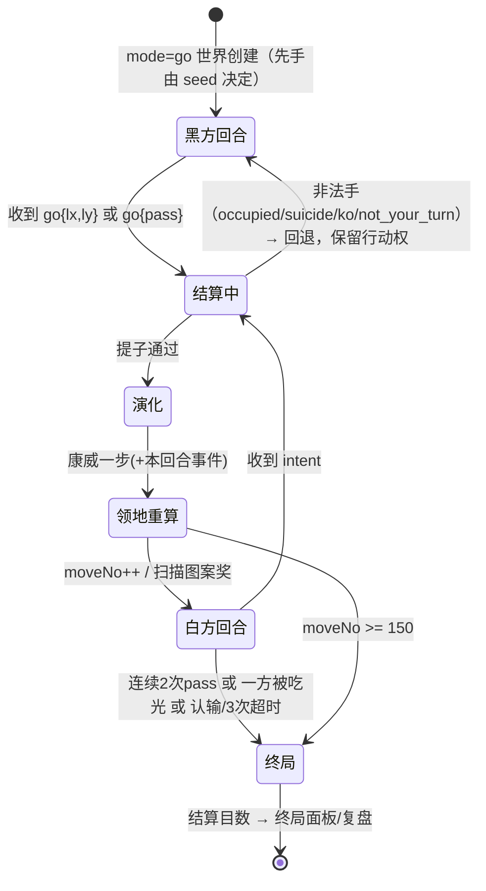

# 回合制模式（go）· 增量 PRD

> 本文只描述**一个增量**：在现有 algowild / 涌现之地（实时模式 rts）之上新增"回合制模式（go）"。
> 已有系统（46 内核、14 涌现单位、生命棋盘、Voronoi 领地、AI）**全部复用**，不新造单位、不新造名词。
> 本文不改动任何游戏代码，仅作为架构/开发/QA 的输入。

## 0. 项目信息

| 项 | 值 |
| --- | --- |
| Language | 中文 |
| Programming Language | **沿用项目现状**：Node.js + 原生前端（无框架，`server/` + `public/client.js` + `public/index.html`）。本增量为已有仓库的功能扩展，不引入 Vite/React/MUI/Tailwind |
| Project Name | `go_mode`（内部代号；对外叫"回合制 · 演化棋"） |
| 文档类型 | 增量 PRD（相对 `docs/PRD.md` / `docs/GDD.md` 的 delta） |
| 关联铁律 | IR-3a 算法确定性（禁 `Math.random()` / `Date.now()`，一律 `mulberry32(this._rng)`）· IR-3b 离散 tick · IR-3c 算法不可读档 · "延迟=惯性" · "算法是世界法则，单位是涌现" |

### 原始需求（逐字引用，不可篡改）

> "弄完这个搞回合制的模式，回合制的不要有那么多东西，只有一个棋盘，只有玩家/电脑玩家没有其它乱七八糟的单位，落子位置可自由选定位置，没有强弱棋子的区分，以先后拓展位置来决定哪个抢占领地，类似围棋，每回合演化类似康威生命游戏，你也可以优化一下规则，但是不要太复杂"
>
> "别忘了算法，还有那些类似康威生命游戏的一些不可预测的数学的东西"

### 已锁定决策（不再更改）

- 吃子规则 = **正统围棋吃子**：气（liberty）判定 + 禁自杀 + 劫（ko）禁着。
- 单局时长 = **标准 ~15 分钟**，每步 30 秒（上限），**总手数上限约 150 手**。
- **只有一条命**：回合制模式里没有复活（棋子被吃光 = 出局）。

---

## 1. 产品目标

**一句话**：回合制模式是一个 32×32 单棋盘、只有黑白两方棋子的双人对局——每回合在任意空格落一子，按围棋规则提子，随后全盘跑一步康威演化让细胞自己往外长；谁先把细胞拓展到哪片空地，那片地就归谁；15 分钟、150 手内比谁的目数多。

**为什么做**（3 个正交目标）：

1. **可上手**：把 rts 的"移动 + 资源 + 纪元 + 涌现单位 + 潮汐"全部剥离，只剩"选一个点 → 点下去"，让新玩家 30 秒内知道要干什么、怎么干，直接解决"我完全没看出来游戏咋玩"。
2. **保留灵魂**：把 rts 里被包装过重的两件事——**康威演化的不可预测性**和**Voronoi 抢地**——留在这个最简棋盘上，且成为唯一的核心变量，而不是背景噪音。
3. **可复盘**：种子 + 手顺 = 完整棋局。同一 seed 跑两遍逐手一致（IR-3a），天然支持"回放/复盘/教学"，这是 rts 实时模式给不了的。

**不做的事（Out of Scope，明确划线）**：

- 不新增任何涌现单位 / 资源 / 科技 / 纪元 / 潮汐 / 冲刺 / HP / 复活；
- 不做实时 20TPS 驱动（go 世界只在收到落子 intent 时推进一手，见 §7）；
- 不做"强弱棋子"（不复用 `11..18` 弱痕段，只有一种子）；
- 不做多人混战（固定 2 方：1 人类 vs 1 AI，或 2 人类）。

---

## 2. 用户故事

| # | 视角 | 用户故事 |
| --- | --- | --- |
| US-1 | 新手 · 单人 vs AI | 作为**第一次打开游戏的新玩家**，我希望进入后只看到一个棋盘和一句"点空格落一子"，以便我在 30 秒内明白这个游戏要干什么、怎么干，而不用先读演化纪元/潮汐/资源。 |
| US-2 | 新手 · 理解差异 | 作为**从没玩过这类游戏的新玩家**，我希望落子后能立刻看到"我的细胞自己长出了一圈"并且 HUD 告诉我为什么，以便我感知到这个游戏跟普通围棋不一样——地盘会自己长。 |
| US-3 | 进阶 · 单人 vs AI | 作为**想练棋的玩家**，我希望 AI 在 1~1.5 秒内出手且从不下非法手，并且我能选难度，以便我不会被等待打断心流，也不会因为 AI 乱下而学不到东西。 |
| US-4 | 进阶 · 理解不可预测 | 作为**想把"数学"玩明白的玩家**，我希望看到"世界事件""影响半径呼吸""图案奖"的提示与日志，以便我知道刚才那一手是被什么算法改变了，而不是觉得系统在随机坑我。 |
| US-5 | 多人 · 双人对局 | 作为**想和朋友开一局的人**，我希望建房时能选"回合制"，拿到带模式的邀请链接，朋友点开就直接进同一棋盘，以便我们不用先研究怎么进同一个世界。 |
| US-6 | 多人 · 公平与节奏 | 作为**回合制双人对局的一方**，我希望有 30 秒倒计时、超时自动停一手、以及明确的终局与比分，以便对手挂机时这局不会无限拖下去。 |
| US-7 | 通用 · 复盘 | 作为**输了一局想搞明白的人**，我希望终局面板能逐手回放并标出"被提子 / 触发事件 / 图案奖"的关键手，以便我知道自己输在哪一手，而不是只看到一串分数。 |

---

## 3. 需求池

优先级：**P0 = 没它这个模式不成立**；P1 = 应该有的完整体验；P2 = 锦上添花。

| ID | 需求 | 优先级 | 验收标准 |
| --- | --- | --- | --- |
| GO-01 | 世界支持 `mode`：`'rts' \| 'go'`（默认 `rts`），贯穿创建/加载/快照 | P0 | `POST /api/worlds {name, seed, mode:'go'}` 返回 `worldId`；`snapshot()` 含 `mode:'go'`；**不传 mode 的旧调用行为逐字节不变**（rts 回归全绿） |
| GO-02 | 回合状态机：行动方、手数、pass、换手、终局相位 | P0 | 快照 `go:{ turn, moveNo, maxMoves:150, phase:'play'\|'over', passStreak, lastMove }`；非行动方落子被拒并回 `not_your_turn` |
| GO-03 | 落子 intent 通道：`{go:{lx,ly}}` / `{go:{pass:true}}`，复用现有 intent FIFO | P0 | intent 到达后 1 tick 内完成"落子→提子→演化→领地"并广播；非法手返回原因：`occupied` / `suicide` / `ko` / `not_your_turn` / `out_of_board` |
| GO-04 | 正统围棋提子：4-连通团、正交气、禁自杀、劫禁着 | P0 | 6 条预置盘面单测全绿：①提单子 ②提整团 ③禁自杀（落子后无气且不提子）④有气可落（不误判自杀）⑤劫禁着（立即回提被拒）⑥劫后他处应一手可回提 |
| GO-05 | 每回合康威演化一步（见 §4 R2.3：诞生=8邻恰好3 + 多数派阵营 + 平票种子 RNG；死亡=8邻≥4 拥挤；本回合落子免疫死亡；无孤独致死） | P0 | 同 seed + 同手顺跑两次，**逐手盘面完全一致**；演化产生的新细胞与手落子同等参与提子与领地 |
| GO-06 | 领地判定与计分：Voronoi 归属格（半径 R）+ 宏观区过半归属 + 终局分 = 归属格数 | P0 | 给定静态盘面可离线复算目数，与 HUD/结算面板显示一致（误差 0） |
| GO-07 | 终局条件与结算：连续 2 次 pass / 150 手 / 被吃光出局 / 认输 / 连续 3 次超时 | P0 | 5 种终局各 1 条用例；结算数据含双方目数、提子数、区数、事件日志、终局原因 |
| GO-08 | 客户端 go 渲染分支：32×32 棋盘铺满 canvas、点击落子、隐藏全部 rts 元素 | P0 | go 模式下不绘制地形/资源/涌现单位/玩家头像/潮汐/纪元；点击命中误差 ≤1 格；棋盘占 canvas ≥90% 宽 |
| GO-09 | 每手 30 秒倒计时，超时 = 自动 pass | P0 | 倒计时归零自动 pass 并广播 `pass` 事件；连续 2 次 pass（含超时）终局；累计 3 次超时判负 |
| GO-10 | AI 对手（至少 1 档），走同一套规则、同一份种子化 RNG | P0 | AI 出手 ≤1.5s（P95）；10 局内**零非法手**；AI 不在非自己回合出手 |
| GO-11 | 模拟内禁用 `Math.random()` / `Date.now()`（IR-3a） | P0 | `grep` 校验 go 相关代码路径无二者；双跑一致性用例通过 |
| GO-12 | 世界事件：每 25 手（第 25/50/75/100/125 手）由 `markov_chain` + 种子 RNG 抽 1 个（繁盛 / 寒潮 / 拥挤突变），仅影响**该回合的演化参数** | P1 | 事件在 HUD 横幅 + 事件日志可见；同 seed 事件序列可复现；事件不改变棋子归属，只改变演化 |
| GO-13 | 影响半径呼吸：R 在 {3,4,5} 间按 `markov_chain` 转移，每 10 手一次，HUD 常驻显示"当前 R / 下次呼吸手数" | P1 | R 变化时领地边界整体涨落可见；HUD 数值与 `_updateVoronoi` 内部使用值一致 |
| GO-14 | 图案奖：识别周期平移图案（5 格、会自己走的图案）+ 周期振荡图案（3 格翻转），一次性 +5 / +2 目并提示 | P1 | 预置 2 个盘面能稳定识别并只奖励一次（重复图案不重复计分）；提示文案里**不出现算法命名的单位名**（铁律） |
| GO-15 | AI 三档难度：简单（≤0.2s 启发式）/ 普通（≤0.8s，1~2 层 `minimax` + `monte_carlo_eval`）/ 困难（≤1.5s，`mcts`） | P1 | 三档耗时达标；困难档对简单档 10 局胜率 ≥70% |
| GO-16 | 新手引导：首局 3 步强制引导（点哪 / 为什么 / 演化会长出去）+ `?` 规则速查弹窗 | P1 | 新账号首局引导完成率 ≥80%；规则速查一屏内讲完 R1~R3 |
| GO-17 | 落子预览与合法性提示：悬停显示半透明预览子 + 该团气数；非法点显示红叉 + 原因文案 | P1 | 悬停 200ms 内出预览；自杀点/劫点悬停即提示，不必点了才知道 |
| GO-18 | 终局复盘：`seed + 手顺` 逐手前进/后退，关键手（提子/事件/图案奖）打点 | P1 | 任意一局可在终局面板完整回放；回放盘面与实战逐手一致 |
| GO-19 | 模式切换入口：创建世界面板加"模式"下拉 + URL `?mode=go&worldId=xxx` 自动选中 + 邀请链接带 mode | P1 | 三种入口都能进入 go 棋盘；rts 邀请链接行为不变 |
| GO-20 | 悔棋：仅人机局允许"撤回上一手（连撤自己+AI 两手）" | P2 | 悔棋后盘面 = 两手前的盘面（含演化状态），审计一致；多人局不可用 |
| GO-21 | 观战席位：第三方连接只读，不影响行动方与计时 | P2 | 观战者看到与行动方一致的盘面；掉线不触发判负 |
| GO-22 | 后手补偿（贴目）与和棋阈值（差 ≤3% 判和） | P2 | 配置开关，默认关闭；开启后结算含 ±komi 明细 |
| GO-23 | 战绩/天梯按 mode 分榜（复用 `scoresRepo`） | P2 | rts 榜单与 go 榜单数据隔离 |
| GO-24 | 棋盘尺寸可配置（32 / 24 / 19），默认 32 | P2 | 切换尺寸后渲染、领地、计分、AI 全部正常；`lifeW` 随配置下发 |

**P0 最小集 = GO-01 ~ GO-11**（11 项）：即可玩、可判定胜负、可复现的最小闭环。

---

## 4. 规则设计（核心）

> 设计原则：**能用 1 条规则说清就不用 3 条**。全部规则共 8 条（R1~R8），可在规则速查里一屏讲完。

### R1 棋盘与棋子

- **棋盘** = 现有 32×32 生命棋盘（`World.LIFE_W = 32`，`LIFE_CELL = 6`），1024 个交叉点；显示上按现有 8×8 = 64 个 4×4 宏观区划分（复用 `World.REGION_W`），只是给人看"我占了多少区"，不额外计分。
- **棋子只有一种**：己方细胞。编码**复用 lifeGrid 的强细胞段 `1..8`**（本模式只用 `1`=先手/黑、`2`=后手/白）。**不使用弱痕段 `11..18`**（回合制没有"走过留痕"）。`World._isStrong` / `_factionOfCell` 可直接复用，客户端零改动即可显示。
- **先后手**：`mode==='go'` 时先手（黑）由 `this._rng()` 从 `world.seed` 派生决定，HUD 明示；**人机局默认人类先手**（引导友好）。无贴目（P2 可选，见 GO-22）。
- **开局空盘**（围棋式）。空盘不是"空城"：首局有 3 步强制引导（GO-16），并且第一手落子后第 1 次演化就会"长出东西"，玩家 10 秒内必然看到反馈。

### R2 一手棋的四步结算（服务端原子执行，一次广播给双方）

```
落子 → 提子（围棋） → 康威演化一步 → 领地重算 + 换手 + 事件推进
```

#### R2.1 落子

点击一个空格（`lifeGrid[x][y] === 0`）→ 写为当前行动方 faction。非空格 / 非当前行动方 / 越界 → 拒绝并回原因（GO-03）。

#### R2.2 提子（正统围棋）

- **连通性**：4-连通（上下左右）同色团——复用 `_captureEnclosed` 的连通收集。
- **气**：正交 4 邻中的**空格**数量（围棋定义；不用 8 邻，8 邻会让"斜着连"也算气，手感不对）。
- **顺序**：先提掉对方所有无气团 → 再检查己方：若己方（刚落子所在的团）仍无气 → **该手非法（禁自杀）**，整手回退并提示。
- **劫**：记录上一手造成的盘面哈希；若本手落子后盘面与"对方上一手之前"的盘面完全相同 → 禁止（劫禁着），提示"劫——先在他处应一手"。只记 1 手（简单劫）。

#### R2.3 康威演化一步（本模式的灵魂）

全盘**同步**更新一次，三条裁决，一次讲清：

| 裁决 | 规则 | 为什么 |
| --- | --- | --- |
| **诞生** | 空格，且 8 邻活细胞数 **恰好 = 3** → 诞生新细胞；阵营 = 8 邻中**数量最多**的阵营；**平票时用 `mulberry32(this._rng)` 抽**（确定性，非 `Math.random()`） | 这是"拓展"的引擎：你落一子，几回合后它自己往长。边界上的诞生会平票 → 边界归属天然不确定 |
| **死亡** | 已有细胞（不论阵营）8 邻活细胞数 **≥ 4** → **拥挤而死**。孤独不死（1~3 个邻居都活） | **拥挤致死是唯一死法**，它自动在密集团块里掏出空洞 → 空洞就是"气眼" → 与围棋提子天然咬合。而且它可读："别把子堆成一坨，会挤死" |
| **当回合落子免疫** | **本回合刚落下的子不参与死亡判定**（但仍参与诞生计数） | 避免"落下去当场挤死"的挫败感。它下一回合才会被挤死——这是可预期的 |

- **演化产生的新细胞与手落子完全同等对待**：同阵营、可被提、参与领地归属。这就是"以先后拓展位置来决定哪个抢占领地"——**先落子的一方，其细胞成为该片空地的种子并会自己长大；后来者必须落得更近、或把前者的子提掉，才能翻盘。**
- **明确裁决（回答"会不会把棋子演化死"）**：会，但只有一种死法——**挤死**，而且是当回合安全、下一回合才生效。不是随机死亡，不是孤独死亡。玩家可以在落子预览里看到"这一手会不会让某个团挤死"（GO-17）。

#### R2.4 领地重算 + 换手 + 事件推进

重算 `_lifeOwner`（Voronoi，半径 R 见 R4）→ `moveNo++` → 换手 → 触发该手的周期事件（R5）与图案扫描（R6）。

### R3 领地与计分

- **领地 = Voronoi 归属**：每个生命格归"最近的棋子"，超出该方当前影响半径 R 则中立——**直接复用 `_updateVoronoi`**，唯一改动是半径不再由纪元决定，改用 R4 的呼吸半径。
- **宏观区归属**：4×4 区内归属格过半（≥8/16）→ 该区归该方——**复用 `_updateRegionControl` 的过半逻辑**，去掉"帝国纪元"门槛。区数只用于 HUD 显示，不额外计分。
- **终局分 = 归属格数（目）**。提子不单独计分：提子通过"削减对手子力 → 对手 Voronoi 种子变少 → 领地缩小"自然兑现，少一条规则。
- **为什么"先后拓展"能决定归属**：先手在空地落子 → 该点成为 Voronoi 种子 → 演化让它长成一簇（种子变多、覆盖变密）→ 后来者的种子必须更近才能翻转该片。抢占"窗口期"（大片空地 + 当前 R 较大）就是本模式的核心技巧。

### R4 机制① 影响半径呼吸（领地涨潮/退潮）

- R 在 **{3, 4, 5}** 三档间变化，**每 10 手**用种子化 `markov_chain` 内核转移一次（固定转移矩阵：保持 0.6 / ±1 各 0.2）。
- HUD 常驻显示：`影响半径 R=4 · 第 40 手呼吸`。
- **玩家感知**：领地边界整体涨潮/退潮。R 变大时远处空地突然归你，R 变小时你必须赶紧补子才守得住。**同一片空地在不同回合归属会变**——这是"算法在改规则"，但规则是公开可见的，不是暗箱。

### R5 机制② 世界事件（稀有、可预期节奏、不可预期内容）

- **每 25 手**触发一次（第 25 / 50 / 75 / 100 / 125 手），由种子化 `markov_chain` 从 3 个事件中抽 1 个（非等概率：繁盛 0.4 / 寒潮 0.3 / 拥挤突变 0.3）：

| 事件 | 效果（**仅影响该回合的演化参数，不引入任何单位，不改变棋子归属**） |
| --- | --- |
| **繁盛** | 本回合演化连跑 2 步 |
| **寒潮** | 本回合演化暂停（不演化） |
| **拥挤突变** | 本回合拥挤致死阈值临时改为 5（宽松）或 3（严苛），二选一由种子决定 |

- **玩家感知**：顶部横幅 + 棋盘闪一下 + 事件日志可回看。玩家学到的是"每 25 手会有事发生，但发生什么由这局的种子决定"——节奏可预期、内容不可预期，正好是"不可预测的数学"的正确剂量。

### R6 机制③ 图案奖（把不可预测变成可追逐的目标）

- 每手结算后扫描盘面，识别两种经典生命游戏图案（复用 GDD §E01/E02 的识别思路，但**不生成单位、不命名单位**，只给分 + 高亮）：

| 图案 | 判定 | 奖励 |
| --- | --- | --- |
| **会行走的图案**（5 格，若干手后整体平移 1 格） | 检测到同形位移 | 所属阵营 **+5 目**，提示"你的细胞长出了会行走的图案" |
| **振荡图案**（3 格，横/纵周期翻转） | 检测到 2 步周期 | **+2 目**，提示"振荡" |

- **同一图案只奖励一次**（记录坐标指纹）。
- **玩家感知**：玩家会主动去"培育"能长出图案的形状——**不可预测的数学变成了可追求的正反馈**，而不是纯随机挨打。这一条是整个"别忘了算法"需求里最重要的可读性设计。

### R7 终局与胜负

触发**任一**即终局：

1. **双方连续 pass**（含超时 pass）→ 终局（围棋终局）。
2. **总手数达 150**（双方合计）→ 终局。
3. **一方棋子被吃光** → 该方立即负（一条命，无复活）。触发门槛复用 `World.WIPE_ELIM_MIN_CELLS = 4`（曾达到 ≥4 子才判，避免开局即负）。
4. **认输** / **累计 3 次超时** → 判负。

结算：比**归属格数（目）**，多者胜；单人局结束时弹终局面板（双方目数 / 提子数 / 区数 / 事件日志 / 关键手回放入口）。

### R8 时长控制

- **每手 30 秒倒计时**（HUD 环形进度）。**超时 = 自动 pass**，**不做随机落子**（随机落子会让玩家觉得"系统在替我乱下"，也不符合"我的决策我负责"的回合制心智）。
- 连续超时 2 次 = 终局（与 R7.1 合并）；累计 3 次超时 = 判负。
- **预算核算（重要，避免数字打架）**：30 秒是**上限**不是均值。目标均值 **5~8 秒/手** → **150 手 × 6 秒 ≈ 15 分钟**，符合既定目标。若实测偏长，把手数上限降到 **120**（而不是缩短倒计时，缩短倒计时会伤害思考型玩家）。
- **AI 出手**：简单 ≤0.2s / 普通 ≤0.8s / 困难 ≤1.5s；思考时显示"推演中…"，**超预算则退化为启发式最优先**（绝不阻塞回合）。AI 与玩家共用同一套规则和同一份种子化 RNG。

### 状态机（供架构/开发直接落地）



---

## 5. UI 设计稿

### 5.1 界面线框（go 模式）

```
┌──────────────────────────────────────────────────────────────────────────────┐
│ 涌现之地 · 回合制        第 37 / 150 手        ⏱ 23s        R=4（第40手呼吸） │  ← 顶部状态条
├──────────────┬────────────────────────────────────────────┬──────────────────┤
│ 侧栏（精简）  │                                            │  比分面板          │
│              │            32 × 32 棋盘（canvas）            │                  │
│ 模式 回合制   │      ┌──┬──┬──┬──┬──┬──┬──┬──┬──┐           │ ● 黑  你   312 目 │
│ ● 黑 你(先手) │      │  │  │● │  │  │  │  │  │  │           │ ○ 白  AI   268 目 │
│ ○ 白 AI      │      ├──┼──┼──┼──┼──┼──┼──┼──┼──┤           │ ▓▓▓▓▓▓░░░ 54%     │
│ 房间码 A1B2  │      │  │  │  │◐ │  │  │  │  │  │           │                  │
│ [复制邀请]    │      └──┴──┴──┴──┴──┴──┴──┴──┴──┘           │ 提子 黑12 / 白7   │
│ [规则速查 ?]  │   ● 黑子  ○ 白子  ◐ 本回合演化新长  ◌ 非法    │ 占区 黑30 / 白26  │
│              │   最后一手：金色描边 + 脉冲动画                │                  │
│ 操作          │   悬停：半透明预览子 + 该团气数               │ 事件日志          │
│ 点击空格落子  │   非法（自杀/劫/挤死预警）：红叉 + 文案        │ · 25手 繁盛       │
│ [Pass] [认输] │   新长细胞：淡入 + 外扩一圈微光               │ · 50手 寒潮       │
│              │                                            │ · 32手 图案奖 +5  │
│ 提示区        │                                            │                  │
│ "你先占角，   │                                            │ [终局] 隐藏       │
│  演化和 R=4   │                                            │                  │
│  会帮你长出去" │                                            │                  │
└──────────────┴────────────────────────────────────────────┴──────────────────┘
                       ↑ 点击即落子；⏱ 环形倒计时在棋盘右上角
```

**终局结算弹窗**（复用现有 `#modal`）：

```
┌──────────────────────────────────┐
│ 终局 · 手数上限 150              │
│ ● 黑  你    312 目   ← 胜        │
│ ○ 白  AI    268 目               │
│ 提子 12 / 7      占区 30 / 26    │
│ 关键手：#32 图案奖  #88 提 5 子   │
│ [逐手复盘]  [再来一局]  [返回]    │
└──────────────────────────────────┘
```

### 5.2 与现有 HUD 的差异

| 类别 | 元素 | 处理 |
| --- | --- | --- |
| **隐藏** | WASD 移动 / 惯性 / 速度、冲刺与充能、HP 与复活倒计时、死亡次数 | go 模式不渲染 |
| **隐藏** | 六类资源与 `stock` 面板、奇点胜利进度、资源采集提示 | go 模式不渲染 |
| **隐藏** | 涌现单位列表 / 涌现数、14 单位图鉴 | go 模式不渲染（**没有其它乱七八糟的单位**） |
| **隐藏** | 潮汐相位、演化纪元与里程碑、变异、MST 帝国网、要塞提示、影响半径（纪元版） | go 模式不渲染 |
| **隐藏** | 地形与资源点渲染、小地图/世界坐标系 | go 模式不渲染（只画 32×32 棋盘） |
| **保留** | 房间码 + 复制邀请链接、玩家列表（2 方）、棋盘与 Voronoi 势力底色（← 客户端已实现，零改动）、聊天（折叠）、`toast`、`modal` | 原样 |
| **新增** | 顶部：手数 `37/150`、行动方指示（轮到你 / 推演中）、30s 环形倒计时 | |
| **新增** | 比分面板：双方目数条 + 百分比、提子数、占区数 | |
| **新增** | 影响半径 `R=4（第40手呼吸）` 常驻显示 | |
| **新增** | 事件日志（可滚动，含图案奖记录） | |
| **新增** | 棋盘：最后一手标记、悬停预览 + 气数、非法点红叉、本回合新长细胞的淡入与高亮 | |
| **新增** | 操作区：`Pass` / `认输` 按钮、`?` 规则速查弹窗 | |
| **新增** | 终局结算弹窗 + 逐手复盘控件（P1） | |

---

## 6. 模式切换的用户路径

### 6.1 进入路径（三条，GO-19）

1. **创建世界时选**（主路径）：侧栏「世界」面板新增一行 **模式：`实时` / `回合制`** 下拉（默认 `实时`），点「建世界」→ `POST /api/worlds {name, seed, mode:'go'}`。
2. **URL 直达**：`/?mode=go&worldId=xxx` → 客户端自动把模式下拉选中为「回合制」并直连该世界（便于把邀请链接直接贴给朋友）。
3. **邀请链接带 mode**：「复制邀请链接」产出 `.../?mode=go&worldId=xxx`，点开即进同一棋盘，无需二次选择。

### 6.2 与 rts 共存

- 同一个 `activeWorlds` Map、同一套 WS 协议、同一个 `World` 类；世界实例自带 `mode` 字段，所有分发点按 `mode` 分支，**rts 行为逐字节不变**。
- **页面入口**：登录后的世界面板即可切换；不强制首屏二选一（避免给新玩家增加一道门槛，也不破坏 rts 老玩家路径）。快速建房沿用现有按钮 + 当前选中的模式。
- **世界列表/存档**：`worldsRepo` 记录 `mode`，重进世界回到对应模式（若 DB 需加字段，见 §8 待确认问题）。

---

## 7. 技术接入点（供架构师落地，本文不改动代码）

| 环节 | 现状 | go 模式的接入方式 |
| --- | --- | --- |
| 创建世界 | `server/routes.js:62` `POST /api/worlds` 只接受 `{name, seed}`，`new WorldEngine(id, req.user.id, sd)` | 增加 `mode`（默认 `rts`），透传给 `World` 构造器第 4 个参数 `opts` |
| 世界构造 | `server/engine.js:36` `constructor(worldId, ownerId, seed)`，`this._rng = mulberry32(seed)` | 增加 `opts.mode`；go 模式跳过 `_genResources/_seedOnboarding/_maybeAddAI(4槽)`，改为 **2 个座位**（人 + AI，或 2 人） |
| 推进 | `server/net.js:294` `w.tickOnce()`（网络驱动）、`server/index.js:103`（后台 20TPS 驱动） | **关键**：go 世界**必须排除在后台 20TPS tick 之外**（否则手数/计时会失控），只在收到合法落子 intent 或超时 pass 时推进一手 |
| 快照 | `server/engine.js:1022` `snapshot()`，已输出 `lifeGrid`（:1111）、`lifeW`（:1112）、`lifeOwner`（:1117）、`regionFaction`（:1119） | go 模式**复用同一批字段**，额外加 `mode` 与 `go:{turn, moveNo, maxMoves, phase, passStreak, lastMove, influenceR, events[]}`；rts 分支返回体不变 |
| 客户端渲染 | `public/client.js:836` 直接读 `state.world.lifeGrid` / `lifeOwner` / `lifeOwners` | **零改动即可显示棋子与势力底色**；新增 go 分支：隐藏 rts 图层、canvas 点击 → `intent {go:{lx,ly}}`、绘制手数/倒计时/比分/预览 |
| 提子 | `server/engine.js:723` `_captureEnclosed`（8 邻数气 + 4-连通 + 归功） | 改为**正交 4 邻数气**并加**禁自杀 / 劫禁着**（R2.2）；建议新增 go 专用方法而非改 rts 行为 |
| 演化 | `server/engine.js:667` `_lifeStep`（阵营感知 B3/S23 + 强细胞豁免） | 新增 go 专用演化：诞生=8邻恰好3（多数派，平票种子 RNG）、死亡=8邻≥4、无孤独致死、当回合落子免疫 |
| 领地 | `server/engine.js:889` `_updateVoronoi` + `:925` `_updateRegionControl`（半径由纪元 `_influenceR` 决定） | 复用，半径改由 R4 呼吸半径提供；区块过半逻辑复用，去掉纪元门槛 |
| AI | `server/ai.js` + 内核 `mcts` / `minimax` / `monte_carlo_eval` / `opening_book` | 新增 go 模式的 AI 决策入口（候选点生成 → 评估 → 落子），共用 `this._rng`，限时预算（R8） |
| 确定性 | `mulberry32(this._rng)`，全种子化 | go 模式全部随机（平票诞生、事件抽取、R 呼吸、AI 决策）**必须走 `this._rng`**；**禁 `Math.random()` / `Date.now()`**（IR-3a） |
| "延迟=惯性" | 服务器只按到达时间 FIFO 处理 intent，不检测不补偿 | 回合制下保持一致：**非行动方的落子 intent 直接丢弃并回原因**；同一格的竞争由到达顺序决定（先到先得）；断线**不暂停**（计时继续，超时即 pass）——见 §8 Q4 |

---

## 8. 待确认问题（需架构师 / 用户拍板）

| # | 问题 | 为什么需要拍板 | 我的倾向 |
| --- | --- | --- | --- |
| **Q1** | **棋盘用 32×32（复用，零改动）还是缩到 24×24？** 150 手在 1024 格上会不会太稀疏（覆盖率不足 → 大片中立，观感空）？ | 直接决定"先后拓展"的观感与 P0 工作量（缩尺寸要动 `LIFE_W` 与客户端） | 先按 32×32 出可玩版，实测一手：**终局时非中立格占比 ≥60%** 则保留 32；否则 24。把尺寸做成配置（GO-24，P2） |
| **Q2** | **AI 难度分几档、是否值得上 MCTS？** 1.5s 预算内 MCTS 能到什么棋力？ | 影响 P0 的 AI 工作量（GO-10 只要求 1 档）与 P1 排期（GO-15） | P0 只做"普通"一档（启发式 + 1 层 `minimax` + `monte_carlo_eval`，≤0.8s）；MCTS 放 P1，实测胜率达标再加 |
| **Q3** | **悔棋范围？** 仅人机可悔（连撤两手）？多人局是否要"双方同意悔棋"？ | 回合制天然可回放，悔棋实现成本低，但会弱化"一条命/决策负责"的紧张感 | 仅人机局提供悔棋（GO-20，P2），多人局不提供；复盘（GO-18）优先于悔棋 |
| **Q4** | **断线/掉线时是否暂停 30 秒计时？** 这与铁律"延迟=惯性，不检测不补偿"直接冲突 | 回合制里"对手掉线 = 我白等"的体验很差，但暂停会破坏铁律的一致性 | 建议：**盘面推进不暂停（保持铁律），但计时在"无 WS 连接"时暂停并给对手可见提示**（这是网络层状态，不是延迟补偿），请拍板 |
| **Q5** | **后手要不要贴目（komi）？** 先手由 seed 决定但无贴目，是否公平？ | 围棋必须有贴目才平衡；但本模式有"演化放大先手优势"的可能（先落子先长） | 先做**无贴目 + 人机局人类先手**回避；上线后用 AI 自对弈（先手方胜率）校准，>55% 再在 P2 引入 komi（GO-22） |
| **Q6** | **是否需要排行榜按 mode 分榜（GO-23）？** 以及是否需要观战席位（GO-21）排进本迭代？ | 都是 P2，影响迭代范围与 DB 表结构 | 本迭代不做；`scoresRepo` 预留 `mode` 字段即可，避免后续迁移 |

---

## 9. 与项目铁律的一致性自检

| 铁律 | 本模式的落实 |
| --- | --- |
| **算法是世界法则，单位是涌现** | 本模式**不新增任何单位**；"会行走的图案 / 振荡"是**图案现象**，只给目数与高亮，**不命名、不生成单位**（R6）。算法（康威演化、`markov_chain`、`monte_carlo_eval`/`mcts`）是规则与世界事件，不是棋子 |
| **延迟 = 惯性**（不检测不补偿） | 非行动方 intent 丢弃；同格竞争先到先得；落子结果只对"到达顺序"负责（§7）。Q4 是唯一需要拍板的边界 |
| **IR-3a 算法确定性** | 平票诞生、事件抽取、R 呼吸、AI 决策**全部走 `mulberry32(this._rng)`**；模拟内禁 `Math.random()` / `Date.now()`（GO-11） |
| **IR-3b 离散 tick** | 一手 = 一次离散结算（落子→提子→演化→领地），无连续时间积分 |
| **IR-3c 算法不可读档** | 随机不可存档重掷；但**手顺可存档**——`seed + 手顺` 可 100% 重放（GO-18 复盘即基于此，不违反 3c：重放的是"玩家决策"，不是"算法输出"） |
| **不要太复杂（用户原话）** | 全部规则 = R1~R8 共 8 条，可在一屏规则速查内讲完；计分只有"归属格数"一项；死法只有"挤死 + 被提"两种 |

---

## 10. 验收门槛（本增量可发布的 Definition of Done）

1. 新玩家（无引导）**30 秒内**能说出：目标（占更多地）、操作（点空格落子）、差异（细胞会自己长）。—— 对应"我完全没看出来游戏咋玩"的底线。
2. P0 需求 GO-01 ~ GO-11 全部通过验收标准（含 6 条提子单测、双跑一致性）。
3. 一局人人对局可在 **12~20 分钟**内自然结束（30 次实测中位数落在区间内）。
4. 同 seed 同手顺两次运行**逐手盘面一致**。
5. rts 模式全量回归无差异（GO-01 验收标准兜底）。
